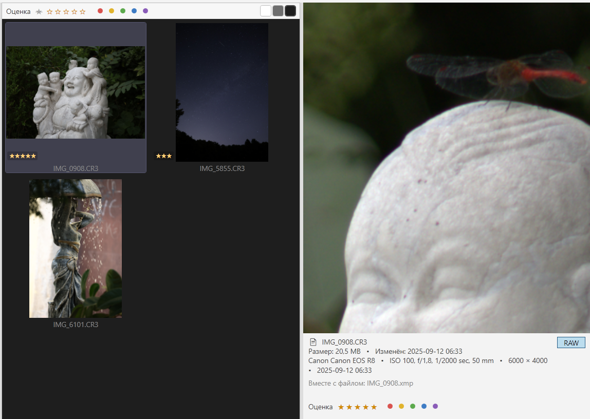
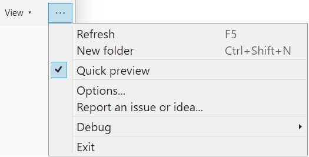
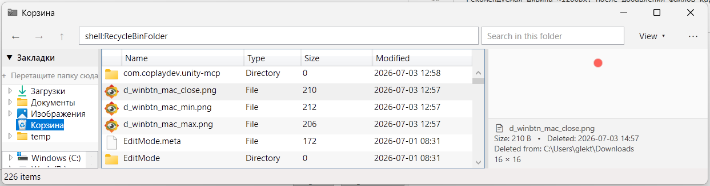

# Wander

**Кастомный файловый проводник для Windows 11 на WPF / .NET 10.**

Альтернатива системному проводнику: без лишнего, стабильнее поведение,
с удобствами. На текущем этапе — рабочая бета с навигацией, файловыми
операциями, корзиной и превью.

<p>
  <a href="https://github.com/lekta/wander/releases/latest">
    
  </a>
  
  
</p>


> ⚠️ **Beta 0.2** — ранняя версия. Работает, но возможны баги. Распространяется
> «как есть», без гарантий (см. [Безопасность и гарантии](#безопасность-и-гарантии)).
> 
> [Лицензия](#лицензия) **PolyForm Noncommercial 1.0.0** - свободное некоммерческое использование.

## Как скачать и запустить

1. **[Страница последнего релиза](https://github.com/lekta/wander/releases/latest)**
2. Скачать `Wander.exe` из блока Assets
3. Запустить. **Установка не требуется** — это портативная версия,
   ничего в систему не прописывает

При первом запуске Windows SmartScreen может показать предупреждение (файл не
подписан сертификатом) — это нормально для бесплатного ПО: «Подробнее» →
«Выполнить в любом случае».

Хочешь проверить целостность файла — рядом лежит `Wander.exe.sha256`:

```pwsh
(Get-FileHash Wander.exe -Algorithm SHA256).Hash
# сравни с содержимым Wander.exe.sha256
```

### Системные требования

- **Windows 10 версии 2004 (build 19041) или новее / Windows 11** (x64).
- Ничего ставить не нужно — .NET встроен в exe (self-contained).
- Для превью веб-/markdown-контента используется **WebView2 Runtime**, который
  уже предустановлен в Windows 11 и в актуальной Windows 10 (идёт с Edge). Если
  вдруг его нет — [Evergreen Runtime от Microsoft](https://developer.microsoft.com/microsoft-edge/webview2/).

## Фичи и планы

- Дерево дисков и папок с lazy-load по раскрытию. Более удобная навигация, стабильные деревья файлов
- Иконки и превью файлов (в т.ч. картинки, GIF, WebM, markdown, текст). В планах - превью всего, что может читать система
- Навигация: Back / Forward / Up, адресная строка с хлебными крошками и памятью последних папок (`F4`)
- Открытие файлов через системную ассоциацию (двойной клик), рабочие системные ссылки (.lnk)
- Контекстное меню в духе Windows 10: весь список сразу, пункты сторонних приложений (7-Zip, TortoiseGit…) со своими иконками, выключение любого пункта в настройках
- **Корзина** вместо безвозвратного удаления по умолчанию. Подтверждение на любой деструктивной операции (**Cancel по-умолчанию**).
- Хоткеи: `Alt+←/→/↑`, `F5`, `Del`, `Ctrl+C/X/V`, `F2` — переименование прямо в строке, `Ctrl+F` — фильтр по папке, `Ctrl`+колесо — размер значков, буквы — переход к файлу по имени
- Буфер обмена общий с системой: скопированное в Wander вставляется в Проводнике и наоборот
- Список обновляется сам, когда файлы в открытой папке меняет кто-то другой
- Вариативное отображение и связи. Есть типы файлов/папок, которые хочется скрывать, чтобы не было шума (desktop.ini, .meta).
- Связи. .meta и другие спутники относятся к своим файлам — операции над ними идут совместно, одной записью в `Ctrl+Z`
- Плагины. Если идея зайдёт, можно будет впилить кастомные поведения
- Панель просмотра для папки показывает перепись: сколько файлов и папок, общий размер, какие типы занимают место
- Интерфейс на русском

📖 **[Руководство пользователя](docs/GUIDE.md)** — что умеет приложение,
горячие клавиши, настройки, что делать если что-то пошло не так.

Текущее превью: можно через ЛКМ зумить ров-файлы, отображаются мета-данные


Меню
- View: можно выбрать отображение (таблица, список, крупные иконки) и сортировку 
- Главное меню: включить превью, настройки, репорт ошибки/предложения


Корзина: видно содержимое и откуда что удалено, восстановление — первым пунктом контекстного меню


## Безопасность и гарантии

- **Вредоносного кода нет.** Это можно проверить:
  **весь исходный код открыт для чтения**.
- **Аналитики, рекламы и т.п нет.** Приложение работает
  локально с твоей файловой системой, интернет не требуется
- **Релизный `Wander.exe` собирается на серверах GitHub**
  ([workflow](.github/workflows/release.yml)) прямо из кода этого репозитория.
  Логи каждой сборки публичны (вкладка *Actions*), а SHA256 в релизе позволяет
  убедиться, что скачанный файл — ровно тот, что собрал CI.
- **Но:** гарантировать отсутствие *багов* я не могу. Это ранняя бета, и в
  теории ошибка может привести к потере данных. Именно поэтому в проекте есть
  подтверждения на удаление и корзина по умолчанию — но полагайся на бэкапы и
  не тестируй на единственной копии важных файлов. Ответственности за возможный
  ущерб я не несу (см. дисклеймер в [LICENSE](LICENSE)).

## Лицензия

[PolyForm Noncommercial 1.0.0](LICENSE) © Lekta, 2026.

Коротко: приложением можно свободно пользоваться, изучать код, изменять его и
распространять — **в любых некоммерческих целях**. Коммерческое использование
требует отдельной договорённости с автором. ПО поставляется «как есть», без
гарантий и ответственности.

Это source-available лицензия (не OSI open-source): исходники открыты для чтения
и некоммерческого использования, но зарабатывать на них без разрешения нельзя.

---

## Сборка из исходников

Как устроен код — [docs/ARCHITECTURE.md](docs/ARCHITECTURE.md).
Как предлагать изменения — [CONTRIBUTING.md](docs/CONTRIBUTING.md).

### Требования

- [.NET 10 SDK](https://dotnet.microsoft.com/download/dotnet/10.0)
  (`winget install Microsoft.DotNet.SDK.10`).

### Разработка

```pwsh
# Восстановить зависимости и собрать всё решение
dotnet build Wander.slnx

# Прогнать юнит-тесты Core
dotnet test Wander.slnx

# Запустить приложение
dotnet run --project src\Wander.App
```

### Собрать релизный портативный exe

Ровно то, что делает CI, — один самодостаточный файл `Wander.exe`, которому не
нужен установленный .NET:

```pwsh
dotnet publish src\Wander.App `
  -c Release `
  -r win-x64 `
  --self-contained true `
  -p:PublishSingleFile=true `
  -p:IncludeNativeLibrariesForSelfExtract=true `
  -p:EnableCompressionInSingleFile=true `
  -o publish
```

Готовый файл — `publish\Wander.exe` (~73 МБ, весь .NET внутри).

> Трим (`PublishTrimmed`) для WPF не поддерживается — не включать.
> Нужен файл поменьше — можно собрать framework-dependent (без `--self-contained`),
> но тогда пользователю понадобится установленный
> [.NET 10 Desktop Runtime](https://dotnet.microsoft.com/download/dotnet/10.0).
