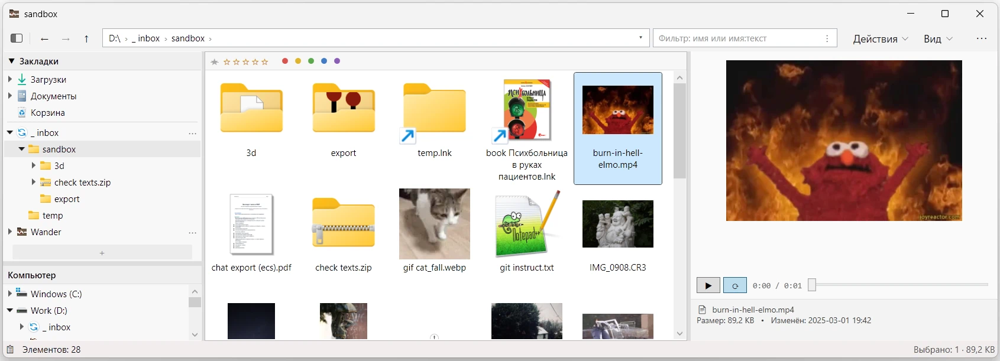
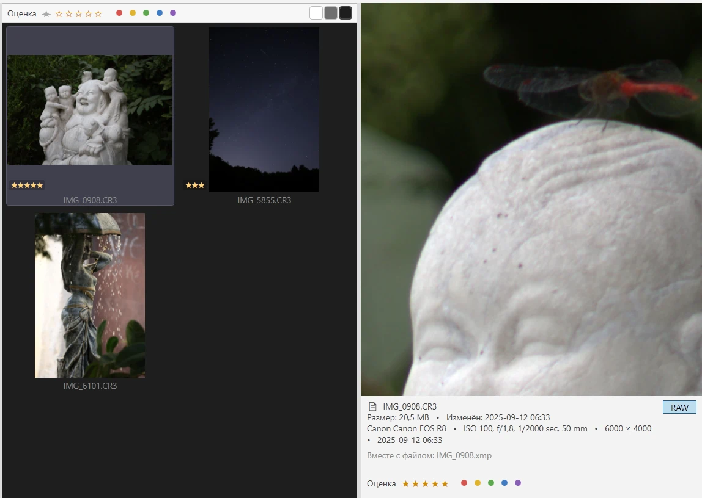

# Wander

**Кастомный файловый/медиа менеджер для Windows 11 на WPF / .NET 10.**

Альтернатива системному проводнику: без лишнего, стабильнее поведение,
с удобствами. Портативный exe, ставить ничего не нужно. Упор на медиа
(прокачанный предпросмотр, оценки RAW).

<p>
  <a href="https://github.com/lekta/wander/releases/latest">
    
  </a>
  
  
</p>



> ⚠️ **Beta 0.4** - ранняя версия. Работает, активно используется, но не исключены баги.
> Распространяется как есть, без гарантий (см. [Безопасность и гарантии](#безопасность-и-гарантии)).
> 
> [Лицензия](#лицензия) **PolyForm Noncommercial 1.0.0** - свободное некоммерческое использование.

## Как скачать и запустить

**[Страница последнего релиза](https://github.com/lekta/wander/releases/latest)** - скачать `Wander.exe` из блока Assets и запустить

**Установка не требуется** - это портативная версия,
ничего в систему не прописывает. Настройки и кэш живут в
`%LOCALAPPDATA%\Wander`; запуск с `--portable` держит их в папке `data` рядом с exe

При первом запуске Windows SmartScreen может показать предупреждение (файл не
подписан сертификатом) - это нормально для бесплатного ПО: «Подробнее» →
«Выполнить в любом случае».

Чтобы проверить целостность файла, рядом лежит `Wander.exe.sha256`:

```pwsh
(Get-FileHash Wander.exe -Algorithm SHA256).Hash
# сравни с содержимым Wander.exe.sha256
```

### Системные требования

- **Windows 10 версии 2004 (build 19041) или новее / Windows 11** (x64).
- Ничего ставить не нужно - .NET встроен в exe (self-contained).
- Для превью веб-/markdown-контента используется **WebView2 Runtime**, который
  уже предустановлен в Windows 11 и в актуальной Windows 10 (идёт с Edge). Если
  вдруг его нет - [Evergreen Runtime от Microsoft](https://developer.microsoft.com/microsoft-edge/webview2/).

## Что умеет

- **Навигация.** Дерево дисков и панель закладок, с асинхронной загрузкой
  и памятью состояния. Всё как в проводнике, только чётко.
- **Просмотр.** Картинки (и TGA, HEIC, SVG) и RAW, GIF, видео, музыка с обложкой и
  проигрывателем, 3D (STL, OBJ, glTF), документы (PDF, HTML, MHT, RTF,
  FB2), markdown, текст и код с подсветкой; Word, Office и EPUB - текстом,
  программы - карточкой с версией и подписью; `Ctrl` + `F` ищет в тексте.
  Миниатюры - обложка альбома и обложка книги, а не общий значок.
- **Галерея.** Режим включается сам в папке с изображениями: крупные картинки,
  настраиваемый фон. Поддерживаются оценки и цветные метки из файла-спутника
  (`.xmp`, `.pp3`), отображаются на миниатюре, поддерживают фильтр.
  Полный экран по `Enter` - снимок за снимком или пара рядом для сравнения.
- **Отбор снимков.** Фокус-пикинг по полному кадру, резкость числом 0-100,
  клиппинг по каналам, гистограмма, «поднять тени» и «приглушить света» -
  в панели просмотра и прямо на миниатюрах галереи. Плюс точка фокуса,
  которую записала камера.
- **Поиск.** Быстрый фильтр по имени на каждую букву - маски `*.cs;*.xaml`,
  через двоеточие ищет текст внутри файлов разных форматов.
  Отдельное окно - маска **и** текст, с подпапками или без. Читает любую
  кодировку, `.docx` / `.xlsx` / `.pptx` / `.epub` / OpenDocument, а `.doc`,
  `.rtf` и `.pdf` - обработчиками Windows.
- **Навигация по архивам.** `Enter` на `.zip`, `.7z`, `.rar`, `.tar.gz`
  работает как в папках: список, сортировка, фильтр, просмотр и миниатюры
  снимков. Извлечь можно копированием/перетаскиванием (содержимое архива в текущей версии
  не изменяется), либо открыть файл изнутри - распакуется во временную копию.
- **Действия над файлами.** Настраиваемое контекстное меню - можно скрывать шумные
  системные пункты и добавлять свои (возможны различные предзаданные действия
  при наличии сторонних утилит: ffmpeg, LibreOffice, pandoc - конвертация документов, музыки, изображений, видео).
  Есть функционал группового переименования. Перетаскивание ПКМ на папку - результат
  операций сразу отправляется в неё.
- **Безопасность операций.** Корзина вместо безвозвратного удаления,
  подтверждение на любой деструктивной операции (**Cancel по умолчанию**),
  `Ctrl` + `Z` на всё обратимое. Системные пути закрыты, логика покрыта тестами.
  Окно решения конфликтов с миниатюрами и сравнением;
  папки сливаются, как в Проводнике.
- **Интеграция с системой.** Общий буфер обмена и drag & drop с
  Проводником, системные ассоциации и ярлыки `.lnk`, контекстное меню в
  духе Windows 10.
- **Мелочи, которых не хватало.** Список сам обновляется, когда папку
  меняет кто-то другой. Панель просмотра для папки считает перепись:
  сколько файлов, общий размер, какие типы занимают место. Файлы-спутники
  (`.meta`, `.pp3`) идут одной строкой с основным и переезжают вместе с ним.
  Шум вроде `desktop.ini` прячется. Интерфейс на русском.

📖 **[Руководство пользователя](docs/GUIDE.md)** - детальный гайд, возможности,
горячие клавиши, настройки.

Панель просмотра: RAW увеличивается зажатой кнопкой мыши, рядом метаданные снимка. Можно быстро выставлять оценку и фильтровать по ней


## Безопасность и гарантии

- **Код безопасен.** Это можно проверить: **исходники открыты для чтения**.
- **Аналитики, рекламы и т.п нет.** Приложение работает локально с файловой системой, интернет не требуется.
- **Релизный `Wander.exe` собирается на серверах GitHub**  ([workflow](.github/workflows/release.yml)) прямо из кода этого репозитория.
  Логи каждой сборки публичны (вкладка *Actions*), а SHA256 в релизе позволяет
  убедиться, что скачанный файл - ровно тот, что собрал CI.
- **Но:** гарантировать отсутствие *багов* не могу. Приложение писалось главным образом для своего удобства
  и автор им постоянно пользуется. Но это ранняя бета, пользователей мало, и в
  теории есть место ошибкам. Ответственности за возможный
  ущерб я не несу (см. дисклеймер в [LICENSE](LICENSE)).

## Лицензия

[PolyForm Noncommercial 1.0.0](LICENSE) © Lekta, 2026.

Коротко: приложением можно свободно пользоваться, изучать код, изменять его и
распространять - **в любых некоммерческих целях**. Коммерческое использование
требует отдельной договорённости с автором. ПО поставляется «как есть», без
гарантий и ответственности.

Это source-available лицензия (не OSI open-source): исходники открыты для чтения
и некоммерческого использования, но зарабатывать на них без разрешения нельзя.

---
## Сборка из исходников

Как устроен код - [ARCHITECTURE.md](docs/ARCHITECTURE.md).
Как предлагать изменения - [CONTRIBUTING.md](docs/CONTRIBUTING.md).

### Требования

- [.NET 10 SDK](https://dotnet.microsoft.com/download/dotnet/10.0)
  (`winget install Microsoft.DotNet.SDK.10`).

### Разработка

```pwsh
# Восстановить зависимости и собрать всё решение
dotnet build Wander.slnx

# Прогнать юнит-тесты Core
dotnet test Wander.slnx

# Запустить приложение
dotnet run --project src\Wander.App
```

### Собрать релизный портативный exe

Ровно то, что делает CI, - один самодостаточный файл `Wander.exe`, которому не
нужен установленный .NET:

```pwsh
dotnet publish src\Wander.App `
  -c Release `
  -r win-x64 `
  --self-contained true `
  -p:PublishSingleFile=true `
  -p:IncludeNativeLibrariesForSelfExtract=true `
  -p:EnableCompressionInSingleFile=true `
  -o publish
```

Готовый файл - `publish\Wander.exe` (~74 МБ, весь .NET внутри).

> Трим (`PublishTrimmed`) для WPF не поддерживается - не включать.
> Нужен файл поменьше - можно собрать framework-dependent (без `--self-contained`),
> но тогда пользователю понадобится установленный
> [.NET 10 Desktop Runtime](https://dotnet.microsoft.com/download/dotnet/10.0).
