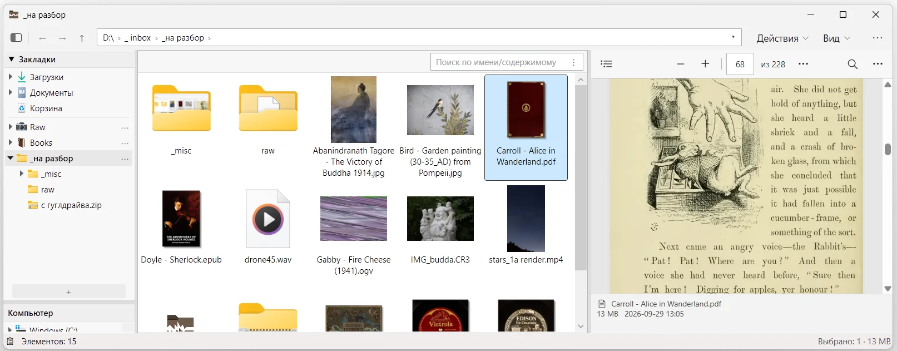

# Wander

**Медиа-менеджер для Windows 10 и 11** - с упором на удобство и работу с фото: навигация без сюрпризов, мгновенный просмотр, отбор снимков, групповые операции.

  
  
  

- 🌐 **[Сайт и руководство](https://lekta.github.io/wander/)** - что умеет Wander и как им пользоваться.
- ⬇️ **[Скачать последнюю версию](https://github.com/lekta/wander/releases/latest)** - `Wander.exe` в блоке Assets.
- 🛡️ **[Надёжность и скорость](https://lekta.github.io/wander/guide/nadezhnost-i-skorost/index.html)** - как Wander проверяется и собирается.

> ⚠️ **Beta 0.5** - ранняя версия. Работает, активно используется, но не исключены баги.
> Распространяется как есть, без гарантий.

## Запуск

Скачать `Wander.exe` и запустить, установка не нужна: один файл, .NET
внутри, в систему ничего не прописывается. Поддерживаемая ОС - **Windows 10 версии 2004
(build 19041) или новее, либо Windows 11**, x64.

- SmartScreen может предупредить, что файл не подписан сертификатом:
  «Подробнее» → «Выполнить в любом случае».
- Целостность файла: хэш скачанного - `(Get-FileHash Wander.exe -Algorithm
  SHA256).Hash` в PowerShell. Сравнивать с `sha256:…` в строке
  **`Wander.exe`** на странице релиза или с содержимым файла
  `Wander.exe.sha256`; регистр букв не важен. Хэш в строке
  `Wander.exe.sha256` - это хэш самого текстового файла, не программы.
- Превью HTML, Markdown и PDF использует **WebView2 Runtime** - он уже есть
  в Windows 11 и актуальной Windows 10; если нет -
  [Evergreen Runtime от Microsoft](https://developer.microsoft.com/microsoft-edge/webview2/).

## Лицензия

[PolyForm Noncommercial 1.0.0](LICENSE) © Lekta, 2026. Пользоваться,
изучать и менять код, распространять - свободно **в любых некоммерческих
целях**. Коммерческое использование - только по договорённости с автором. Это
source-available лицензия (не OSI open-source); ПО поставляется «как
есть», без гарантий и ответственности.

## Разработка

Сборка из исходников, тесты и правила для pull request -
[CONTRIBUTING.md](docs/CONTRIBUTING.md); устройство кода -
[ARCHITECTURE.md](docs/ARCHITECTURE.md); уязвимости -
[SECURITY.md](docs/SECURITY.md).
