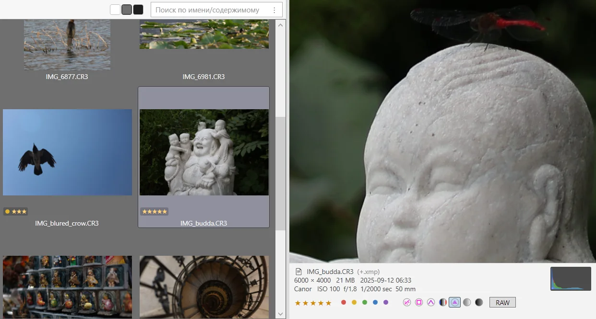

# Wander — руководство пользователя

Что умеет приложение и как этим пользоваться. Установка — в [README](../README.md).

## Начало работы

Wander — портативный exe: скачали, запустили, ничего в систему не
прописывается. Настройки, логи и кэш миниатюр живут в
`%LOCALAPPDATA%\Wander`. При первом запуске SmartScreen может предупредить
о неподписанном файле: «Подробнее» → «Выполнить в любом случае». Как
скачать и проверить контрольную сумму — [README](../README.md).

**Портативный режим**: `Wander.exe --portable` держит настройки, логи и
кэш миниатюр в папке `data` рядом с exe (флешка, другой компьютер);
`--data-dir <путь>` — в указанной папке. Где именно — строка `Data root`
в начале лога сеанса.

**Открыть сразу в папке**: `Wander.exe --folder <путь>` — сеанс начинается
в ней, а не в последней или рабочей; если папки нет — как без ключа.

**Окно.** Слева панель папок: закладки, под ними дерево дисков
«Компьютер». В середине область файлов: адресная строка с крошками, над
списком поле поиска и, в папке с оценёнными снимками, фильтр по звёздам,
сам список в одном из четырёх видов. Справа панель просмотра (`Ctrl` +
`Q`): выделенный файл, для папки — перепись. Внизу строка состояния:
журнал действий слева, сообщения, свёрнутые операции и «сколько выбрано»
справа. `Tab` ходит по областям, `Ctrl` + `1` / `2` / `3` — сразу в папки,
список, просмотр; `Esc` откуда угодно возвращает клавиатуру в список.
Подробно — «Клавиатура и фокус».

**Для чего.** Упор на медиа и разработку. Папка со снимками сама
открывается галереей; хелперы отсмотра и оценки прямо на миниатюрах,
полный экран с парой снимков рядом, RAW показывается мгновенно из
встроенного превью. Для кода и проектов: текст и код с подсветкой в панели
просмотра, поиск по содержимому с масками, спутники Unity `.meta` одним
элементом с файлом, свои команды в меню «Действия», «Открыть в терминале».

**Основные сценарии.**

- По папкам ходят деревом и закладками; дерево не сворачивается само,
  раскрытые ветки переживают перезапуск — «Папки».
- Папку смотрят в подходящем виде: таблица, плитки, значки, галерея;
  выбор закрепляется за папкой — «Область файлов».
- Файл находят полем поиска над списком: сначала эта папка, потом
  вложенные; двоеточие ищет текст внутри — «Поиск».
- Смотрят, не открывая: панель просмотра знает картинки и RAW, видео,
  музыку, документы, код, архивы — «Просмотр», полный список — «Форматы».
- Копируют, переносят, удаляют как в Проводнике, с системным буфером и
  перетаскиванием; всё, кроме `Shift` + `Delete`, откатывает `Ctrl` + `Z` —
  «Файловые операции».
- Снимки отбирают в галерее: хелперы, оценки цифрами, фильтр по звёздам —
  «Отбор снимков».

**Настройки** — главное меню `⋯` → «Параметры»; частые галочки — правым
кликом по пустому месту панели папок. Это руководство — на сайте
[lekta.github.io/wander](https://lekta.github.io/wander/guide/); его
открывает пункт «Помощь» в том же меню, а `F1` в настройках — на разделе об
открытой странице. Если что-то не так — раздел «Если что-то пошло не
так»: журнал действий и лог сеанса.

## Область файлов

### Виды и размеры

Меню «Вид»: таблица, плитки, значки, галерея (`Ctrl` + `Shift` +
`6` / `7` / `2` / `1`, как в Проводнике); сортировка по имени, дате, размеру,
типу, оценке, «по возрастанию», «папки сверху». В таблице — клик по
заголовку. Те же «Вид» и «Сортировка» — в меню пустого места папки.

Выбор вида относится к **открытой папке** и закрепляется за ней; подпись
«Эта папка · …» в меню говорит, почему папка показана так: «закреплён»,
«авто: снимки» или «по умолчанию». «Автоматически» снимает закрепление,
«Сделать видом по умолчанию» отдаёт текущий вид всем папкам без закрепления
(то же — «Настройки» → «Вид» → «Вид по умолчанию»; из коробки —
значки). Сортировка — так же: выбранный порядок (и клик по заголовку
таблицы) закрепляется за открытой папкой, «По умолчанию» снимает
закрепление, «Сделать сортировкой по умолчанию» отдаёт порядок папкам без
своего (из коробки — по имени, папки сверху). Закрепления лежат в
`folders.json` в папке данных, переезжают вместе с папкой, когда её
переименовывает или переносит Wander, а папку, переименованную снаружи,
находят по дате создания.

Выделенный файл не уходит с экрана сам: он остаётся на своём месте, когда
меняется то, что вокруг, — снят или поставлен фильтр по звёздам, меткам или
имени, выбран другой порядок, в папке появились или пропали файлы, его
переименовала другая программа, пришли результаты поиска. Меняются соседи,
а не он. Скрыл его фильтр или его удалили — выделен следующий уцелевший, на
его месте. Если вы сами отмотали список от выделенного файла, чужие
изменения его не вернут; а в самом начале списка новые файлы появляются на
виду, список не уезжает.

В плитках и значках — настоящие миниатюры: картинка, кадр видео, первая
страница PDF (всегда, не только при установленной читалке), внутрь папки;
книги `.fb2` / `.epub` — обложкой, ярлык — миниатюрой оригинала со стрелкой.
В таблице значки обычные.

Размер ячейки — потолок, а не цель, как и в панели просмотра: крупные
ужимаются, мелкие не растягиваются. Картинка в 16 пикселей и значок
приложения, у которого нет крупного ресурса, останутся маленькими и
чёткими посреди ячейки, а не раздуются в мыло на всю плитку.

Размеры у каждого вида свои («Настройки» → «Вид» → «Размеры»): таблица —
строка и значок; плитки — ширина, значок, кегль; значки и галерея — ячейка,
картинка, отступ, кегль. Стандартные — как в Проводнике. `Ctrl` + колесо меняет те же поля
и сохраняет; `Ctrl` + нажатое колёсико возвращает стандарт. Расстояние между
значками при зуме не растёт — увеличивается картинка; плотность сетки —
шириной ячейки.

### Галерея

Для папок со снимками: крупные картинки, подпись в одну строку, оценка и
метка в углу миниатюры. Фон — три квадратика на полосе над списком: светлый
(по умолчанию), серый, тёмный; вместе с ним меняются подписи и подсветка,
фон панели просмотра идёт следом. Яркость серого и тёмного — «Настройки» →
«Вид» → «Галерея», в поле после названия фона; квадратик рядом с ним
показывает, что выйдет.

Включается сама в папке, где больше половины файлов — изображения (RAW
считается); спутники, резервные копии и подпапки в счёте не участвуют.
Галочка и доля — «Настройки» → «Вид». Выбор вида руками закрепляется за этой папкой
(до трёх тысяч папок, давно не открывавшиеся вытесняются); выход из папки со
снимками возвращает вид по умолчанию. Архив со снимками галереей становится,
корзина — никогда. Папка, которую Проводник знает как папку изображений
(«Свойства» → «Настройка» → «Оптимизировать эту папку»: «Изображения»),
открывается галереей сразу, без подсчёта.

### Миниатюры и их кэш

Диск: `%LocalAppData%\Wander\thumbs`, ключ учитывает время правки и размер —
устаревшая картинка невозможна. Файл, изменившийся или заменённый другим под
тем же именем, теряет свою миниатюру сразу: пока папка открыта — по
сообщению сторожа, при следующем открытии — по сверке даты и размера. Так что
«удалил картинку, положил другую с тем же именем» показывает новую.
Сбрасывается при обновлении Wander. Папку
можно удалить руками. «Настройки» → «Кэш и память»: выключатель дискового
кэша и его предел (256 МБ), «Очистить кэш» с текущим размером; «Память» →
«Под картинки» — общий потолок для миниатюр и кадров панели просмотра, 0 —
шестнадцатая часть памяти компьютера (16 ГБ → 1 ГБ, под полем названо
число). Пределы действуют сразу, без перезапуска.

Картинки внутри архивов тоже получают миниатюры: из zip читаются в память,
из 7z / rar / tar распаковываются по одной (файлы до 32 МБ); ключ — время и
размер самого архива, пересобранный архив показывает свежие.

### Список

- Список **обновляется сам**, когда папку меняет кто-то другой («Настройки»
  → «Список файлов» → «Изменения от других программ» → «Показывать сразу»;
  `F5` всегда). Вместе с ним —
  панели слева: подпапка, созданная, удалённая или переименованная в открытой
  папке, видна в развёрнутой ветке; `F5` перечитывает все развёрнутые ветки,
  не сворачивая их.
- Внизу справа — сколько выбрано и сколько весит (папки в размер не входят —
  их размер считает панель просмотра).
- Скрытые файлы по умолчанию не показываются; включённые рисуются приглушённо.
  «Настройки» → «Список файлов» → «Показывать в списке»: «Скрытые файлы и
  папки», под ними — «Защищённые системные файлы» (скрытый **и** системный
  атрибут вместе, `pagefile.sys`; один системный атрибут ничего не значит —
  Windows ставит его любой папке с `desktop.ini`) и «Служебные папки и файлы
  в корне дисков» (выключена: `$RECYCLE.BIN`, `System Volume Information`,
  `Recovery`, `$WinREAgent`, `Config.Msi`, `$Windows.~BT` не появляются ни в
  списке, ни в дереве). Обе нижние действуют только вместе со скрытыми.

### Поиск

**Поле поиска** (`Ctrl` + `F`; над списком, у правого края полосы со
звёздами): список сужается на каждую букву, `Esc` сбрасывает всё и
возвращает клавиатуру в список. Сначала текущая папка
(мгновенно), потом через паузу — найденное во вложенных, отдельной группой
**под** тем, что нашлось здесь; ничего не мигает. Обход начинается от двух
символов, отменяется следующей буквой, останавливается по `Esc`. Пока идёт —
кружок в углу списка и счёт в строке состояния; в таблице появляется столбец
«Папка». Нужно только в текущей папке — окно поиска со снятой галочкой
«искать в подпапках».

Маски: без `*` и `?` — вхождение; с ними — шаблон на всё имя.

| Набрано | Найдёт |
|---|---|
| `doc` | всё, где в имени есть «doc» |
| `*.cs` | только `.cs` |
| `*.t*` | расширение на «t» |
| `IMG_?.jpg` | `IMG_1.jpg`, но не `IMG_12.jpg` |
| `*.cs;*.xaml` | и то, и другое |

**Двоеточие** разделяет имя и текст внутри файлов: `*.cs:бюджет`,
`:бюджет` — только текст. Всё после первого двоеточия — текст целиком
(`:http://example.com` ищется как есть). Любой поиск из окна читается в поле
в том же виде; значок `⋮` подсвечивается, когда включён флаг, который в
строку не помещается.

**Окно поиска** (`Ctrl` + `Shift` + `F` или `⋮`): имя (маска), текст, папка
(текущая, следует за навигацией), флаги «искать в подпапках» и «искать и в
двоичных файлах». Имя и текст складываются через **И**: `*.cs` плюс слово даст
четыре файла, а не четыреста, и картинки рядом не откроются. Поле над
списком показывает то же, что и окно; у имени и текста — крестик, который
очищает поле; окно растягивается, держится поверх
главного (не поверх других приложений), `Esc` закрывает и возвращает
клавиатуру в список.

Читается: текст в любой кодировке (UTF-8, UTF-16, Windows-1251, DOS-866),
`.docx`, `.xlsx`, `.pptx`, `.epub`, OpenDocument, а `.doc`, `.rtf`, `.pdf` —
системными обработчиками Windows (`.pdf` — только если установлена читалка).
Картинки, архивы, exe в поиск по содержимому не попадают; галка «в двоичных
файлах» включает побайтовое сравнение латиницы и цифр — кириллица там не
найдётся, галка на это время гаснет.

Запускается сам через мгновение после набора, с любой длины; флаг —
немедленно, `Enter` — сразу. Переход в другую папку сбрасывает поиск целиком
(оба поля и обе галки). Результаты заменяют список: столбцы «Папка» и
«Совпадение», в плитках путь под именем; сортировка работает; «Остановить»
оставляет найденное; `F5` повторяет поиск; вернуться — «Очистить», крестик,
`Esc` или другая папка. Файлы, которые не удалось открыть, названы в конце
строки состояния отдельно. Индекса нет, на диске ничего не остаётся; повторный
поиск по документам ускоряет кэш в памяти до закрытия окна.

## Папки

### Дерево и закладки

Дерево дисков и папок с подгрузкой по раскрытию. Главное отличие от
Проводника: **дерево не сворачивается само** — раскрытые ветки переживают
переходы и перезапуск. Ветка на тысячи подпапок раскрывается без паузы;
при возврате в окно раскрытое перечитывается — папка, созданная в другой
программе, уже на месте. Имя открытой папки — жирным в той панели, откуда
её открыли, куда бы ни ушёл курсор. Экранный диктор видит панель списком
строк, а не деревом: вложенность и раскрытость веток он не называет.

Всю панель папок убирает и возвращает кнопка слева от «←», пункт «Панель
папок» в меню «Вид» или `Ctrl` + `B`; ширина запоминается, `Ctrl` + `1`
при убранной панели сначала возвращает её.

Дерево дисков идёт под заголовком «Компьютер»; над ним — закладки,
отделённые перемычкой (положение запоминается).
Папку добавляют перетаскиванием в зону «+» под списком. Кнопка «…» в строке
(и правый клик) — переместить выше / ниже, убрать из закладок; те же
перемещения — `Ctrl` + `↑` / `↓`. Стандартные папки (Загрузки, Документы,
Изображения, Корзина; в настройках — ещё Рабочий стол, Музыка, Видео) идут
сверху, отделены чертой, меню у них нет.

Закладка на папку, которой больше нет, остаётся серым курсивом без шеврона;
клик показывает в области файлов, что папка удалена или недоступна, и
предлагает «Указать расположение…» (закладка останется на своём месте) или
«Убрать из закладок».

Правый клик по подпапке под закладкой или по встроенной папке
(«Загрузки», «Документы») — меню этой папки, как в дереве дисков:
«Вставить» и «Переименовать» в нём относятся к ней.

`Delete` на своей закладке спрашивает, что убрать: закладку или саму
папку (в корзину; `Shift` + `Delete` — навсегда). Кнопки названы, `Enter`
и `Esc` — отмена. На встроенной закладке («Загрузки», «Документы»,
«Корзина»…) `Delete` папку не трогает, с `Shift` или без: закладка
убирается с панели, вернуть её — Параметры → «Папки и закладки». Удалённая из
дерева папка исчезает из ветки сразу; если
удалили открытую папку или папку над ней, список уходит в ближайшую
уцелевшую, а «Назад» в удалённую честно покажет, что её нет.

При запуске открывается последняя папка — на том же файле и с той же
прокруткой: выделен файл, на котором закончили, сверху та же строка. Файла
больше нет — выделен следующий за ним (последним был — предыдущий); не
осталось и соседей — папка открывается с начала, без выделения. Если нет
самой папки, откроется ближайшая уцелевшая над ней (на своих дисках), а если
она была на флешке или сетевом диске, которых сейчас нет, — рабочая папка
(по умолчанию системные «Документы»). Параметры → «Папки и закладки» → «При
запуске»: «Последняя папка» или «Рабочая папка» — тогда каждый запуск
начинается с неё. Раскрытые ветки восстанавливаются так же.

С клавиатуры стрелки, `PgUp` / `PgDn`, `Home` / `End` в дереве только
двигают курсор, входит `Enter` (Проводник читает каждую папку по дороге).
Мышью клик = переход. Настройка «Открывать папку, на которую перешли с
клавиатуры» («Папки и закладки» → «Панель папок»; та же галочка в меню
панели) возвращает привычку Проводника
без её цены: одиночное нажатие открывает
сразу, зажатая стрелка летит по дереву, открывается папка остановки,
промежуточные не листаются и не попадают в историю.

`F2` в панели (или «Переименовать» в меню папки дерева) переименовывает
папку на месте, в её строке: `Enter` применяет, `Esc` отменяет, клик мимо
применяет. Ветка остаётся раскрытой, открытая папка и «Назад» продолжают
по новому пути, закладка на папку следует за ней; `Ctrl` + `Z` возвращает
всё. Диски, «Корзина», архивы и встроенные закладки («Загрузки»,
«Документы»…) не переименовываются.

Правый клик по пустому месту панели — меню частых настроек: скрытые и
системные файлы, стрелки в дереве, подтверждение при удалении, автообновление,
«Параметры».

### Адресная строка

Хлебные крошки: наведение делает имя кнопкой, клик — переход на уровень.
Клик по пустому месту (или `Ctrl` + `L` / `Alt` + `D`) — поле ввода с полным
путём, `Enter` — перейти, `Esc` — вернуть крошки. Треугольник справа (`F4`)
— 20 последних папок, переживают перезапуск.

## Просмотр

### Панель просмотра

Меню «Вид» или `Ctrl` + `Q`; ширина тянется, запоминается. Клавиатура внутрь
— `Ctrl` + `3` (`Esc` — назад; `Tab` туда не заходит); текст в панели можно
выделить и скопировать `Ctrl` + `C` — строка состояния скажет, что скопирован
текст, а не файл. `Ctrl` + `F` с клавиатурой в тексте, коде или RTF — поле
поиска в правом верхнем углу: «3 из 17», `Enter` / `Shift` + `Enter` по
совпадениям, `Esc` закрывает; `F3` / `Shift` + `F3` — то же из списка. Файл
из поиска по содержимому открывается с этим запросом на первом совпадении
(и во второй половине пары, и в «Сравнить»), клавиатура остаётся в списке;
`F3` после последнего совпадения переходит к следующему найденному файлу
выдачи, после последнего файла — по кругу, строка состояния говорит. У
длинного файла панель показывает первый мегабайт, а совпадения дальше
считает и пишет под полем: «Ещё N дальше в файле — откройте его».

При нескольких выделенных панель показывает активный файл — тот, который
добавили последним (`Ctrl` + клик по новому — его и видно); сводка и
звёзды внизу — про всё выделение. Выделено ровно два файла, и оба
показываются, — картинка делится пополам: стопкой или рядом, смотря как
обе выйдут крупнее — альбомные кадры чаще друг над другом, портретные рядом,
но решает и форма панели; верхний по списку сверху или слева; при
перетаскивании края половины переворачиваются, только когда другой способ
заметно крупнее. У каждой половины в левом нижнем углу свои звёзды, метка
и резкость, в правом — гистограмма, про свой снимок; звёзды видны на 30 %,
пока мышь не подойдёт к низу или не сменится оценка. Футер внизу один на
двоих:
сводка, хелперы, **RAW** на обе половины. Лупа (ЛКМ) на одной половине
показывает то же место второй; с зажатой ПКМ двигается только снимок под
курсором — так совмещают кадры со сдвигом. Третий файл в выделении
возвращает одну картинку.
Файл, который другая программа держит закрытым, панель так и называет:
кто держит.

Что панель показывает для каждого типа файлов — таблица на странице «Форматы».

### Полный экран

`Enter` или `Space` на снимках в галерее. Один снимок — во весь экран,
стрелки листают снимки папки; два выделенных — рядом; больше — по одному,
стрелки ходят только по выделенным. Если в выделении не только снимки,
`Enter` открывает файлы, как раньше. Картинка — до краёв экрана.

`Shift` + стрелка делит экран: слева остаётся показанный снимок, справа —
соседний; следующие `Shift` + стрелки листают правый. `←` или `→` без
`Shift` оставляют на экране левый или правый. Снимок на экране чистый:
звёзды, метки, резкость, хелперы и **RAW** появляются в левом нижнем углу,
гистограмма — в правом, когда мышь у нижнего края (у пары — у обоих снимков
разом) или нажата цифра оценки — на полторы секунды, чтобы видеть, что
поставлено. Цифры ставят оценку снимку (из двух — тому, что под мышью),
`Ctrl` + `Z` отменяет; оценка, которую не удалось записать (файл занят, нет
прав), — плашкой у нижнего края. `Delete` отправляет снимок в корзину, как в
списке (с вопросом, если он включён в настройках; `Shift` + `Delete` —
навсегда), и показывает следующий, после последнего — предыдущий; из двух
удаляется тот, что под мышью, второй остаётся на экране. `Z` — лупа 1:1,
которая держится без кнопки: мышь водит по кадру, у пары вторая половина
следует, ПКМ двигает один снимок; `Z` снова — снять. Курсор пропадает, когда
мышь стоит, и возвращается при движении. `Esc` или `Enter` — назад; после
одного снимка список стоит на последнем показанном.

### Форматы

Что Wander делает с файлом, решает расширение. Одна таблица на всё:
миниатюра в плитках и значках, панель просмотра, полный экран с оценками и
хелперами, поиск по содержимому, встроенная конвертация в меню «Действия».
Пустая ячейка — не поддерживается. У файлов, которых в таблице нет,
миниатюра — системный значок, панель просмотра — имя, размер и дата, а
поиск по тексту читает всё, что похоже на текст.

| Файлы | Миниатюра | Панель просмотра | Полный экран, оценки, хелперы | Поиск по тексту | Конвертация |
|---|---|---|---|---|---|
| **Картинки** `.jpg` `.jpeg` `.jpe` `.jfif` `.png` `.gif` `.bmp` `.ico` `.tif` `.tiff` `.webp` `.tga` | картинка | картинка, лупа; GIF и WebP — анимация с плеером | да | | в JPEG, в PNG, уменьшить до 1920 — сам Wander; в WebP — ffmpeg |
| **HEIC / HEIF** `.heic` `.heif` | картинка¹ | картинка¹ | да¹ | | как картинки |
| **RAW** `.cr2` `.cr3` `.nef` `.arw` `.dng` `.raf` `.orf` `.rw2` | встроенное превью | превью мгновенно, кнопка **RAW** — декод с матрицы | да | | превью JPEG из файла — сам Wander; дальше как картинки |
| **SVG** `.svg` | значок | картинка, `</>` — разметка | | как код | |
| **Видео** `.mp4` `.m4v` `.mov` `.wmv` `.avi` `.mkv` `.webm` | кадр | проигрыватель | | | в MP4 (H.264), сжать, звук в M4A или MP3, кадр в PNG — ffmpeg |
| **Музыка** `.mp3` `.flac` `.m4a` `.aac` `.wav` `.wma` `.ogg` `.opus` | обложка | обложка, теги, проигрыватель | | | в MP3, M4A, FLAC, WAV — ffmpeg |
| **3D** `.stl` `.obj` `.gltf` `.glb` | значок | модель: вращение, зум | | | |
| **Текст** `.txt` `.log` `.csv` `.tsv` `.ini` `.cfg` `.conf` `.toml` `.env` `.mtl` `.gitignore` `.gitattributes` `.editorconfig` | значок | текст, кодировка определяется сама | | да | |
| **Код** — языки, разметка, конфиги, шейдеры и ассеты Unity² | значок | подсветка | | да | |
| **Markdown** `.md` `.markdown` | значок | отрендеренный документ | | да | в DOCX — pandoc |
| **PDF** `.pdf` | первая страница | документ | | обработчиком Windows, если стоит читалка | |
| **HTML, MHT** `.html` `.htm` `.mht` `.mhtml` | значок | страница, в сеть не ходит | | как текст | |
| **Офисные документы** `.doc` `.docx` `.xlsx` `.pptx` `.odt` `.ods` `.odp` | значок | только текст | | да; `.doc` — обработчиком Windows | в PDF — LibreOffice; DOCX в Markdown — pandoc |
| **RTF** `.rtf` | значок | со шрифтами, таблицами, картинками | | обработчиком Windows | в PDF — LibreOffice |
| **Книги** `.fb2` `.epub` | обложка | FB2 — обложка, аннотация, текст; EPUB — только текст | | EPUB — да; FB2 — как текст | |
| **Архивы** `.zip` `.7z` `.rar` `.tar.gz` `.cab` и всё, что открывает папкой Windows | значок; у картинок внутри — миниатюры | содержимое; файл внутри — как обычный | | внутрь не заходит | извлечь |
| **Программы** `.exe` `.dll` `.sys` `.msi` `.ocx` `.scr` `.cpl` `.drv` | свой значок | карточка: версия, компания, подпись | | | |
| **Ярлыки** `.lnk` | миниатюра оригинала со стрелкой | содержимое цели | | | |
| **Спутники** `.xmp` `.pp3` `.meta` | одним элементом с хозяином | оценка и метка; GUID | | | |
| **Папка** | внутрь папки | перепись: файлы, папки, размер, топ типов | | | |
| **Диск** | значок | метка, файловая система, заполнение, перепись | | | |

¹ Нужны «Расширения для изображений HEIF» из Microsoft Store (бесплатно);
без них панель говорит, чего не хватает, и ведёт в Store.

² `.cs` `.csproj` `.props` `.targets` `.sln` `.slnx` `.js` `.ts` `.jsx`
`.tsx` `.mjs` `.cjs` `.py` `.rb` `.go` `.rs` `.java` `.kt` `.swift` `.php`
`.c` `.cpp` `.cc` `.cxx` `.h` `.hpp` `.m` `.mm` `.css` `.scss` `.less`
`.sh` `.bash` `.zsh` `.ps1` `.bat` `.cmd` `.sql` `.xml` `.xaml` `.json`
`.yaml` `.yml` `.diff` `.patch` `.shader` `.cginc` `.hlsl` `.compute`;
ассеты Unity `.asset` `.prefab` `.unity` `.mat` — текстом, если проект
сериализует их в YAML.

Какие программы нужны конвертации и как их указать — «Действия»; хелперы
и оценки — «Отбор снимков».

#### Панель просмотра по типам

| Тип | Что показывает |
|---|---|
| Картинки (и TGA — у Windows для него кодека нет) | ЛКМ — лупа; крупные ужимаются, мелкие не растягиваются |
| HEIC / HEIF | Системным кодеком, повёрнуты как надо. Если Windows не хватает расширения из Microsoft Store («Расширения для изображений HEIF» — бесплатно; «Расширения для видео HEVC» — платно либо уже стоит от производителя), панель говорит, какого, и кнопка открывает его страницу в Store |
| SVG | Картинка; кнопка `</>` в футере показывает разметку и обратно (режим, как **RAW**). Больше 1 МБ — сразу разметкой |
| RAW (CR3, CR2, NEF, ARW, DNG…) | Встроенное превью — мгновенно, с поворотом по EXIF. Кнопка **RAW** в футере — полный декод с матрицы: превью показывается сразу, кадр с матрицы заменяет его примерно через секунду (в углу крутится индикатор); залипает на всю папку |
| GIF, видео | Анимация, проигрыватель: воспроизведение / пауза, повтор (для роликов короче трёх секунд включён сразу), перемотка |
| Музыка (MP3, FLAC, M4A, AAC, WAV, WMA, OGG, Opus) | Обложка, название, исполнитель, альбом, год, битрейт, частота, play / pause, перемотка. Теги — у MP3, FLAC, M4A, WAV; у остальных имя и длительность. Обложка из файла, иначе картинка рядом (`Cover.jpg`, `folder.jpg`, `front.*`, одноимённая, единственная в папке). Русские теги в Windows-1251 читаются правильно |
| 3D (STL, OBJ, glTF, GLB) | Тянуть — вращать, колесо — приблизить; внизу треугольники и вершины. Цвет из `.mtl` (`Kd`) и glTF; текстуры не подтягиваются (у PBR-моделей `Kd` серый — такая останется серой). `.mtl` — как текст. FBX, DAE, DXF — нет |
| Текст | Кодировка определяется сама (1251, 866). Крупный файл — началом, внизу «показано начало, всего N МБ»; поиск в панели считает совпадения и дальше |
| Код | Подсветка: обычные языки, bat / cmd, sh, шейдеры Unity (`.shader`, `.cginc`, `.hlsl`, `.compute`), YAML и ассеты Unity (`.asset`, `.prefab`, `.unity`, `.mat`), `.diff` / `.patch` |
| PDF, HTML, MHT, Markdown | Отрендеренный документ; в Markdown — таблицы, `- [x]`, `~~зачёркнутое~~`, ссылки, сноски. В сеть панель не ходит — внешние картинки и скрипты блокируются (бейджи в README не грузятся) |
| FB2, RTF | Обложка, название, авторы, аннотация, текст (длинная книга — началом); RTF со шрифтами, таблицами, картинками |
| Word, Excel, PowerPoint, OpenDocument, EPUB (`.doc`, `.docx`, `.xlsx`, `.pptx`, `.odt`, `.ods`, `.odp`, `.epub`) | Текст документа с пометкой «Только текст — форматирование не разобрано»: так его читает поиск по содержимому (`.doc` — обработчиком Windows); найденный недавно показывается сразу |
| Программы и библиотеки (`.exe`, `.dll`, `.sys`, `.msi`, `.ocx`, `.scr`, `.cpl`, `.drv`) | Карточка: версия, продукт, компания, платформа (x64, консольная, .NET…), подпись — чья и действительна ли (приходит после остального: проверка читает файл целиком; у файла больше 200 МБ — по кнопке «Проверить»), авторские права |
| Ярлык `.lnk` | Содержимое цели; внизу имя оригинала и «Перейти к оригиналу». Битый ярлык так и говорит |
| Диск | Метка, ФС, тип, полоса заполнения (жёлтая с 85 %, красная с 95 %), ниже перепись |
| Папка | Перепись: файлы, папки, размер, топ типов с полосками. Числа растут по ходу обхода; обход идёт до конца, уход из папки отменяет. Глубже 64 уровней (junction на предка) — панель пишет, что числа неполные |

## Сценарии

### Файловые операции

Как в Проводнике, с теми же клавишами: `Ctrl` + `C` / `X` / `V` копируют,
вырезают и вставляют через системный буфер, перетаскивание левой кнопкой
переносит внутри диска и копирует между дисками, `F2` переименовывает в
строке списка, `Delete` удаляет в корзину. Каждая операция идёт в фоне в
своём окне с прогрессом и отменой — «Ход операции»; совпавшие имена
решаются одним списком до того, как тронут первый файл — «Совпадения
имён»; всё, кроме `Shift` + `Delete`, откатывает `Ctrl` + `Z`. Файл со
спутниками едет целиком — «Файлы-спутники».

**Новая папка** (`Ctrl` + `Shift` + `N`, «Создать» в меню пустого места)
появляется выделенной с открытым редактором имени; `Esc` оставляет «Новая
папка».

#### Перетаскивание

Левой кнопкой: внутри диска — перенос, между дисками — копирование;
`Shift`, `Ctrl` и `Alt` принуждают к переносу, копированию и ярлыку
`.lnk`. Папку можно тащить из дерева. Задержаться над папкой — в панели
свёрнутая раскрывается, в списке открывается; у края панели или списка —
прокрутка, тем быстрее, чем дальше за край. Правой кнопкой — меню на месте
броска: копировать, переместить, ярлыки, «Конвертировать» и «Частные»
сюда; жирным — что сделал бы обычный бросок. Бросок в зону «+» под
закладками добавляет папку в закладки. В Проводник и другие программы
файлы уходят как из Проводника, оттуда — так же.

#### Буфер обмена

`Ctrl` + `C` / `X` — в **системный** буфер: вставляется в Проводнике и
наоборот. Буфер один на систему: скопировали файлы где-то ещё — вставятся
они. Текст или картинка в буфере вставляются файлом: `Ctrl` + `V` кладёт в
папку `Текст.txt` (UTF-8) или `Изображение.png` — из Excel текст ячеек, из
браузера или «Ножниц» картинка — и сразу предлагает переименовать;
занятое имя получает «(1)», `Ctrl` + `Z` убирает файл в корзину. В буфере
и файлы, и текст — вставляются файлы, остальное остаётся в буфере, журнал
это называет. Ничего подходящего — строка состояния перечисляет, что там
было. Файл со спутниками уезжает целиком. Занятый на доли секунды другой
программой буфер — копия работает внутри Wander, строка состояния сообщает;
повторите. Вложения писем, файлы внутри архивов, снимки с телефона Windows
кладёт не путём, а содержимым — Wander об этом пишет, вставить не может.

#### Корзина

`Delete` — в системную корзину; `Shift` + `Delete` — мимо неё (единственная
операция без отмены; всегда спрашивает, очищает историю отмены). Корзина
открывается в Wander — закладка слева (отключается в настройках); видно,
откуда и когда удалено, имена — как были на диске, с расширением. Первый
пункт меню — «Восстановить» (пачкой тоже; не откатывается, как в
Проводнике). Остальные операции внутри недоступны намеренно, оценки
снимкам тоже не ставятся; очистка — системными средствами. Большая корзина
на холодном диске показывается по мере чтения — строки прибывают порциями,
не ждут последней.

#### Отмена и безопасность

`Ctrl` + `Z`: перенос вернётся, переименование отыграется, удалённое
достанется из корзины, созданная папка уедет в корзину, ярлык удалится.
Ограничения: безвозвратное удаление не откатывается; история не переживает
перезапуск (файлы в корзине остаются); чужие операции не отменяются
(вырезали здесь, вставили в Проводнике — перенос сделал он); во время долгой
операции `Ctrl` + `Z` не срабатывает. Сам откат — такая же операция: долгий
показывает прогресс и отменяется; остановленный на середине продолжит
следующий `Ctrl` + `Z`, а файл, который вернуть не удалось, остальным не
мешает — строка состояния назовёт его.

Подтверждение на всё деструктивное, по умолчанию **Cancel**. Вопрос перед
удалением в корзину и перед перемещением снимается в «Настройки» →
«Файловые операции» — `Ctrl` + `Z` вернёт и то и другое; там же «Пропускать
одинаковые файлы без вопроса» для окна «Совпадения имён». Системные пути
защищены: корни дисков и сетевых шар, `C:\Windows` со всем содержимым,
`Program Files`, `ProgramData`, папка пользователей, корень профиля и папки,
которые ведёт Windows, — «Рабочий стол», «Документы», «Загрузки»,
«Изображения», «Музыка», «Видео», AppData (сами папки; то, что внутри, —
ваше; содержимое `Program Files` трогать тоже можно). Извлечь архив или
положить выход действия можно и в корень диска, и в профиль — нельзя
только внутрь `C:\Windows`. Занятый файл называет процесс: «файл
открыт в: Word (PID 1234)»; если из-за него не удалось удалить, окно «Файл
занят» предложит «Повторить» — закройте файл там и повторите (папку с
занятым файлом внутри — так же). Перед отказом Wander до двух секунд ждёт,
не отпустят ли файл, и если отпустили — доделывает; в журнале останется
«был занят (кем) — отпущен». Сам себе он не мешает: видео или PDF, открытые
в панели просмотра, перед удалением, переносом и переименованием
закрываются. Файл, над которым ещё идёт другая ваша операция, не
трогается — «занят операцией Wander: Копирование»; такие файлы в списке
помечены часами на значке — если операция идёт дольше 0,4 с, одновременно
с её окном, короткие обходятся без часов, — а панель просмотра пишет «Идёт:
…» или «В очереди: …».

**Не помещается в корзину.** Путь длиннее 259 знаков (или папка с таким
путём внутри, или диск без корзины) в корзину положить нельзя. Wander такой
файл молча не удаляет: остальное выделение уходит в корзину, а про эти
приходит вопрос со списком имён — «Удалить безвозвратно» или **«Прервать»**
(по умолчанию). Первая кнопка включается через полсекунды, чтобы привычное
`Delete` – `Enter` её не нажало. Замена при
копировании обратима: старый файл уходит в корзину, `Ctrl` + `Z` вернёт обе
стороны (Проводник стирает безвозвратно).

### Отбор снимков

Папка, где больше половины файлов — снимки, сама открывается галереей
(«Галерея»): крупные миниатюры, оценка и метка в углу, хелперы прямо на
миниатюрах. `Enter` — полный экран, стрелки листают, `Shift` + стрелка
ставит два снимка рядом («Полный экран»). Цифры `0`–`5` ставят оценку,
`Shift` + цифра — цветную метку, полоса над списком фильтрует по ним. RAW
показывается мгновенно из встроенного превью; кнопка **RAW** в футере
панели — полный декод с матрицы; превью из RAW отдельным файлом — меню
«Действия» → «Конвертировать». Оценка живёт в файле-спутнике рядом со
снимком, его понимают RawTherapee, darktable и Adobe.

#### Оценки: звёзды и цветные метки

Оценка живёт в файле-спутнике: `.pp3` (RawTherapee), `.xmp` (Adobe,
darktable, exiftool). Полоса фильтра появляется над списком, когда в папке
есть оценённые файлы, работает во всех видах, снимается при переходе в другую
папку. Щелчок по звезде — эта и выше; `Ctrl` + щелчок добавляет / убирает
одну; перечёркнутая звезда слева — снимки без оценки; с метками так же;
стрелка справа от звёзд снимает всё (подпись — в подсказке). Столбец
«Оценка» в таблице — по тому же
правилу, сортируется. В значках оценка — значком в углу, как в
галерее; в плитках — звёздами во второй строке.

`0`–`5` в галерее ставят оценку всему выделенному, `Shift` + `0`–`5` —
цветную метку (та же метка ещё раз снимает её, если она уже у всех); одна
пачка — одно `Ctrl` + `Z` (в других видах цифры — набор имени). Звёзды и
метки в панели просмотра при нескольких выделенных тоже ставятся всем —
рядом со звёздами написано «и ещё N»; в сплите и на полном экране у
каждого снимка свои звёзды — про него. Звёзды и цвет независимы: поставил
цвет — звёзды у каждого остались свои. Оценка не пересобирает папку:
выделение, прокрутка и порядок на месте; при сортировке по оценке новый
порядок приезжает со следующим обновлением. Снимок, который после новой
оценки выпал из фильтра, уходит как удалённый: выделение и клавиатура — на
следующем, прокрутка на месте.

У снимка без спутника звёзды приглушены; первый щелчок предлагает создать
файл — с подтверждением (снимается в «Настройки» → «Оценки», для
прогона по папке RAW), `Ctrl` + `Z` удаляет. Формат по умолчанию `.xmp`:
RawTherapee применяет свой профиль обработки только к снимкам без `.pp3`, и
`.pp3` даже с одной строкой меняет то, как снимок открывается; `.xmp`
такого не делает (RawTherapee читает оценки из XMP с 5.7). Переключатель на
`.pp3` — там же, с предупреждением.

#### Хелперы отсмотра

Семь кнопок в футере панели, слева от **RAW** (на полном экране — в углу
снимка) — то, чем отбирают снимки.
Что делает каждая, написано в подсказке; включаются в любом сочетании,
держатся до выключения, между запусками не хранятся. `Alt` — посмотреть
кадр без подсветки.

| Кнопка | Что показывает |
|---|---|
| Линия с точками | **Фокус-пикинг**: чёткие грани кадра розовым — где на самом деле резко. Считается по полному кадру, в лупе рисуется 1:1. Отдельные точки (снег, блики, зерно) отбрасываются: фокус — это линии |
| Розовый квадрат | **Точка AF**: рамка, где фокусировалась камера (Canon). Камера иногда пишет её мимо — сравни с пикингом |
| Розовый пик | **Резкость** 0–100 по середине кадра: число рядом с датой съёмки, в углу каждой ячейки галереи, в сплите и на полном экране — рядом со звёздами снимка. 70 и выше — резко, 45–70 — мягко, ниже — мимо (пороги пока на глаз) |
| Шкала с синим и красным концом | **Клиппинг**: пересвет цветом канала (красный, зелёный, синий, их смеси, белый — все три), недосвет синим |
| Микро-гистограмма | **Гистограмма** по каналам под кнопками (в сплите и на полном экране — у каждого снимка своя, в правом нижнем углу); яркая полоса у края — сколько кадра ушло в недосвет (слева) и пересвет (справа), проценты в подсказке |
| Светлый кружок | **Тени**: кадр с поднятыми тенями — видно, что в тёмном |
| Тёмный кружок | **Света**: кадр с приглушёнными светами — видно, что в ярком |

В галерее пикинг и кривые рисуются прямо на миниатюрах, а резкость стоит
числом в углу; считается только то, что на экране, и запоминается до конца
сеанса. В режиме **RAW** пикинг ждёт, пока приедет декод с матрицы
(около двух секунд), и меряет по нему.

Фон панели повторяет фон области файлов (в галерее — серый / тёмный, в
остальных видах светлый); подписи подбираются по контрасту. Текст, код и
документы — на светлом. Внизу — сводка: пусто → текущая папка (рекурсивно),
файл → имя, размер, дата, EXIF (включая RAW), несколько → суммарно плюс
то, что у снимков общее: камера, ISO, диафрагма, выдержка, фокусное,
размер — значение, если оно у всех одно, два-три разных через запятую,
больше — поле не пишется (EXIF читается у первых ста); у файла
со спутниками — GUID из `.meta` с кнопкой копирования и оценка звёздами (у
снимка без спутника — приглушённые, первый клик спросит про создание файла).

### Контекстное меню

В духе Windows 10 — весь список сразу. Клик по пустому месту — меню папки:
«Создать», «Вид» и «Сортировка» (те же, что в меню «Вид», — для этой папки),
«Открыть в терминале», «Копировать путь», «Свойства», пункты сторонних
приложений. «Вид» и «Сортировка» повторяют меню «Вид»; кому лишние —
выключаются в «Настройки» → «Контекстное меню». Клик по элементу вне
выделения переносит выделение, внутри — сохраняет группу.

Порядок по частоте: сверху «Открыть», «Открыть с помощью» (системный список
плюс «Выбрать приложение…»), пункты сторонних приложений (7-Zip,
TortoiseGit, Notepad++, антивирусы — с иконками и подменю); внизу подменю
**«Файл»**: вырезать / копировать / вставить, копировать путь / имя,
переименовать / создать ярлык, удалить; туда же файловые пункты Windows
(«Отправить», «Передать на устройство», «Восстановить прежнюю версию»).
Системное «Создать» вливается в наше: «Папка» от Wander (с откатом и
переименованием на месте), следом шаблоны Windows. Дубли (вырезать,
копировать, удалить, свойства, «Копировать как путь», «Открыть в
Терминале» самого Windows Terminal) и «Добавить в избранное» убраны.
«Удалить безвозвратно» в меню нет намеренно — только `Shift` + `Delete`.
«Открыть в терминале» — для папки и фона: Windows Terminal в этой папке, а
без него — PowerShell; тот же пункт есть в меню «Действия».

Первый правый клик в новой папке может занять полсекунды — отвечают
расширения; повтор по тому же файлу мгновенный. `Menu` и `Shift` + `F10`
открывают меню с клавиатуры.

**Настройки → «Контекстное меню».** «Пункты других программ» → «Показывать
в меню» — выключатель целиком: снят — их DLL не загружаются, меню быстрее.
По одному — в таблице: вкл · пункт · программа · для чего (типы файлов, где
пункт показывается); галочка снята — пункта нет в меню. Наведите на строку —
что пункт делает, если он сам это сообщает; строка с именем программы
(«7-Zip») — весь её раздел меню, что внутри, решается при открытии меню.
В таблице — то, что Wander уже встречал в меню (свои пункты Windows —
«Отправить», BitLocker — тоже, их программа — «ОС»), выключенное и пункты
программ и типов, добавленных руками: «Добавить программу или тип файла…»
показывает их, не дожидаясь меню. Установленное, но ещё не встреченное в
таблицу не попадает — оно появляется после первого правого клика там, где
показывается. Клик по заголовку сортирует — по программе, по типам,
выключенные вместе. Над таблицей — поиск по пункту, программе и типам
(крестик и `Esc` его очищают); расширение с точкой (`.mp4`) находит и
пункты для всех файлов — в меню `.mp4` они тоже есть. Программа и типы
приходят из реестра (только чтение), названия — из самих меню. Прочерк
вместо программы — COM-расширение: Windows отдаёт одно склеенное меню и не
говорит, чья строка.
Ярлык записывается типом своей цели: меню `.lnk` на `.txt` — это меню `.txt`
(плюс «Расположение файла»). Выключение запоминается по каноническому глаголу
(у TortoiseGit подпись содержит имя ветки, глагол — нет), у пунктов без
глагола — по подписи. Гасится строка, а не приложение: у TortoiseGit три
строки — три галочки. «Основные пункты» — то, что рисует сам Wander:
открыть, копировать, свойства, «Открыть в терминале», свои действия, «Вид» и
«Сортировка» меню пустого места — по форме меню; снятая галочка убирает
пункт из меню, сочетание клавиш
продолжает работать, подменю убирается целиком. «Сбросить настройки
контекстного меню…» внизу страницы возвращает её к исходной: все пункты
включены, добавленное и встреченное забыто.

## Возможности и окна

### Действия и конвертация

**Меню «Действия»** в шапке, левее «Вид», — то, что можно сделать с
выделенным: первой строкой подпись («4 изображения», «Папка: D:\Фото»,
если ничего не выделено), дальше «Переименовать группой…», подменю
**«Частные»** (свои команды) и **«Конвертировать»** (встроенные),
«Извлечь рядом», «Извлечь…», «Создать ярлык», «Копировать путь», «Открыть в терминале».
Показано только применимое; серым с подсказкой — лишь конвертация, для
которой не хватает программы. В контекстном меню те же «Частные» и
«Конвертировать» стоят над «Файлом». Убрать строку можно в Параметрах →
«Контекстное меню» → «Основные пункты» — пропадёт в обоих меню.

**Переименовать группой** — `F2` на двух и более, или пункт меню. Только
файлы или только папки: на смешанном выделении `F2` пишет об этом в строке
состояния. Сверху шаблон (список хранит пять последних), токены: `[N]` —
прежнее имя, `[C]` — счётчик (с какого, шаг, сколько цифр), `[D]` — дата
изменения, `[D:yyyy-MM-dd]` — она же в своём формате, `[X]` — дата съёмки
из EXIF (у RAW читается не сразу — строки досчитываются), `[P]` — имя
папки; остальное — как написано. Под счётчиком — «Найти и заменить»
(без учёта регистра, по желанию регулярное выражение; `$1` в замене — первая
группа), ниже регистр имени и расширения отдельно. Расширение меняется
только регистром. Справа — таблица «было → станет»: конфликт красным, без
изменений — серым. Нумерация идёт в порядке списка на экране. `Enter` в
поле не применяет — только кнопка «ОК». Правила запоминаются. `Ctrl` + `Z`
возвращает все имена разом; имена можно менять местами, пачка сама
разводит их через временные.

**Свои команды** — Параметры → **«Действия»**. В таблице — вкл · название ·
для каких файлов · где показывать; команда выбранной строки — в карточке под
таблицей, шапка которой — сама строка: тот же голубой, её название,
«Дублировать» и «Удалить»; «Добавить» — под таблицей, новая строка
выделяется и видна. Встроенное действие («встроенное» в шапке) не
правится: его выключают галочкой или дублируют и правят копию. В карточке: название, для каких файлов (группа: изображения, видео, аудио,
текст и код, документы, архивы, папки, всё — или маска `*.psd;*.ai`, она
главнее группы), программа, аргументы, режим, где показывать (оба меню,
контекстное, шапка), в подменю, показывать консоль, файл результата.
Программу выбирают из списка — в нём те, что уже используют действия:
FFmpeg, LibreOffice, Pandoc (их находит страница «Программы»), встроенный
кодировщик изображений и программы ваших строк; новую — кнопкой с папкой
справа от списка (`.exe`, `.cmd`, `.bat`), после чего она появляется в
списке. Не выбранная, не найденная или не найденная страницей «Программы» —
красным под полем. Строка, чья
команда в таком виде не сработает (нет программы, аргументы не подходят к
режиму), — красным, что не так — в карточке. Действие
предлагается, только когда **все** выделенные подходят; действие для
папок без выделения работает на текущую папку. Подстановки в аргументах:

| | |
|---|---|
| `{path}` | файл |
| `{name}` | его имя без расширения |
| `{ext}` | расширение без точки |
| `{dir}` | папка файла |
| `{paths}` | все выделенные — для режима «все одной командой» |
| `{list}` | временный файл со списком путей, по одному в строке (для `@список` и длинных выделений) |
| `{out}` | выход — см. ниже |

Кавычки ставятся сами, писать их не нужно. Режим «на каждый файл» — по
процессу на файл, по очереди, не параллельно; `{paths}` и `{list}` в нём
не работают, а «все одной командой» без них не имеет смысла — таблица
скажет об этом красным. Без «Показывать консоль» (так по умолчанию)
программа идёт без окна, и Wander читает её сообщения об ошибке для
отчёта. Пример: «Открыть в
Notepad++» — программа `C:\Program Files\Notepad++\notepad++.exe`,
аргументы `{path}`.

**Выход** — имя результата рядом с исходным, шаблоном: `{name}.mp4`,
`{name}_small.mp4`. Занятое имя получает номер в скобках — следующий за
наибольшим из уже занятых: рядом с «clip (3)» и «clip (4)» появится
«clip (5)». Программа ничего не перезаписывает. Объявленный выход — это то, что
отменяет `Ctrl` + `Z`: результат уезжает в корзину. Действие без выхода не
отменяется: что сделала программа, Wander не знает. В конце подменю
«Частные» и «Конвертировать» — **«В другую папку…»**: те же действия с
выходом, но сначала спрашивается папка, и результаты всей пачки уходят
туда; отмена и правило номера те же. То же одним жестом: перетащить
файлы **правой кнопкой** на папку — в списке, дереве или закладках — и
выбрать действие в «Конвертировать» / «Частные» в меню на месте броска.

**Конвертировать** — встроенные действия:

| Для чего | Что | Нужно |
|---|---|---|
| RAW | Маленькое и большое превью из RAW (JPEG) — снимки, которые камера положила внутрь файла; стоят первыми | ничего — сам Wander |
| Видео | В MP4 (H.264); сжать (CRF 28) → `_small.mp4`; извлечь звук в M4A или MP3; кадр в PNG | ffmpeg |
| Аудио | В MP3 (192k), M4A (AAC), FLAC, WAV | ffmpeg |
| Изображения | В JPEG (качество 90), в PNG, уменьшить до 1920 по длинной стороне (JPEG) | ничего — сам Wander |
| Изображения | В WebP | ffmpeg |
| Документы | В PDF | LibreOffice |
| `.md` / `.docx` | Markdown → DOCX, DOCX → Markdown | pandoc |

**Программы** — Параметры → **«Программы»**: FFmpeg, LibreOffice, Pandoc,
каждая отдельно — для чего нужна, «Найдена в системе» (`PATH` и обычные
места установки) или «Указана вручную», путь к файлу. Кнопка
**«Указать…»** — выбрать exe самому, он главнее найденного; **«Сбросить»**
— забыть его и снова искать. Не найдена — строка `winget install
Gyan.FFmpeg` (`TheDocumentFoundation.LibreOffice`, `JohnMacFarlane.Pandoc`),
её можно скопировать. В таблице действий программа, которой нет, выделена
красным. Встроенные действия не удаляются и не правятся — их выключают
галочкой или **дублируют** (копия попадает в «Конвертировать» и правится
как своя).

**Встроенный кодировщик изображений** — программа встроенных конвертаций
картинок и превью из RAW; его можно выбрать и в своей строке. Аргументы у
него — не командная строка, а настройки через `;`: `format=jpeg`, `png`,
`bmp`, `tiff` или `gif` — обязательно; `quality=1…100` — качество JPEG
(по умолчанию 90); `maxside=` — длинная сторона в пикселях; `source=preview`
/ `preview-full` — взять JPEG, который камера положила в RAW (маленький или
самый крупный). Пример: `format=jpeg;quality=85;maxside=1920`, выход
`{name}_1920.jpg`. Чего кодировщик не примет, карточка говорит красным под
аргументами, те же настройки — в подсказке поля.

Картинки Wander перекодирует сам: снимок разворачивается по EXIF и дальше
лежит ровно; дата съёмки, камера, выдержка, диафрагма, ISO, фокусное,
**координаты и высота**, рейтинг и копирайт переходят в JPEG и TIFF — и
из RAW тоже, они читаются из самого контейнера. Название, ключевые
слова, комментарий и автор едут, когда их отдаёт системный декодер: из
JPEG и TIFF — да, из RAW — не всегда, из сайдкара `.xmp` рядом — нет. В
PNG, BMP и GIF метаданные не пишутся: их кодерам некуда.
Прозрачное в JPEG и BMP заливается белым. JPEG, которому не надо ни
уменьшаться, ни поворачиваться, в JPEG не пережимается: байты
копируются, меняются только метаданные. RAW, который система не открывает,
конвертируется из встроенного в него JPEG. **Превью из RAW** берёт этот
JPEG как есть, без пережатия и за доли секунды: **большое** (`IMG_lpv.jpg`)
— самый крупный, что положила камера (у CR3, CR2 и ARW — полный кадр),
**маленькое** (`IMG_spv.jpg`) — только у CR3, 1620×1080 (у остальных RAW
оно совпало бы с большим); картинка лежит так, как сняла камера, а в файле
записано, как её повернуть, плюс камера, дата съёмки и координаты.
LibreOffice называет PDF сам и перезаписывает
существующий — у этого действия нет выхода и нет отмены.

**Запуск** идёт в окне операции, как копирование: «файлов: N из M» и имя
текущего. «Отмена» останавливает программу; недописанный результат
уходит в корзину, следующие файлы не запускаются. По окончании — строка
состояния «В MP4 (H.264): готово 3 из 3»; если что-то не вышло — окно со
строкой на файл: имя, код возврата и последняя строка сообщения программы
(не больше двадцати, полностью — в логе сеанса). Действия в корзине и
внутри архива недоступны.

### Архивы как папки

`Enter` или двойной щелчок на `.zip`, `.7z`, `.rar`, `.tar.gz`, `.cab` и
прочих, которые открывает сам Windows, — заходит внутрь, как в папку:
адрес `…\pack.zip\docs`, крошки, `Backspace` наверх, имя, размер, дата.
Своего читателя архивов у Wander нет — открывается ровно то, что умеет
открыть папкой сам Windows. Ассоциация, отданная 7-Zip или WinRAR, этого
не отменяет: в Проводнике двойной щелчок запускает архиватор, а `Enter` в
Wander, путь в адресной строке и дерево открывают архив папкой.

В дереве папок архив стоит среди папок и раскрывается в свои папки, как
в панели навигации Проводника; клик по нему или по папке внутри — тот же
вход. Перетащить что-то *на* архив в дереве нельзя; *из* дерева — можно:
папка архива, брошенная в папку, извлекается, сам архив переносится или
копируется, как любой файл. Меню у строк архива в дереве пока нет.

Внутри архива можно: смотреть список, фильтровать по имени, копировать
(`Ctrl` + `C`) и вставлять в обычную папку — это извлечение, `Ctrl` + `Z`
его отменяет; «Извлечь…» спрашивает папку; **«Извлечь рядом»** — без
вопросов в папку, где лежит сам архив, а совпавшие имена не заменяет:
новое получает «(1)». На самом архиве в обычной папке «Извлечь рядом»
высыпает его содержимое туда же. «Открыть» распаковывает файл во
временную копию и запускает ассоциацией — **правки в такой копии в архив не
вернутся**, строка состояния об этом говорит.

Наружу файлы уходят как из Проводника: `Ctrl` + `C` внутри архива и
`Ctrl` + `V` в любой программе, перетаскивание из списка или дерева в чужое окно.
Распаковывает в обоих случаях сам Windows, и только копированием —
перетаскивание из архива никогда не «перемещает».

Панель просмотра: выделили архив в обычной папке — показывает, что внутри
(первый уровень, до 200 строк); внутри архива клик по пустому месту или
выделенная папка — содержимое этой папки архива; выделили файл **внутри**
архива — показывает его содержимое, распаковав временную копию (одну за
раз, уже распакованная показывается сразу). Файлы больше 32 МБ так не
смотрятся — их распакует «Открыть».

Внутри архива нельзя: удалять, переименовывать, вырезать, вставлять,
создавать. Миниатюры внутри — у картинок (zip читается в память, остальные
распаковываются по одной; папка снимков открывается галереей), у прочих
файлов значки по расширению; поиск по содержимому и по подпапкам туда не
заходит.

Архив с паролем: имена файлов видны, содержимое — нет; извлечение
сообщает, что архив защищён. Архив, зашифрованный целиком (7z с `-mhe`),
выглядит пустым — строка состояния говорит «пусто или защищено паролем»,
отличить эти два случая нельзя.

### Совпадения имён

Если на месте уже лежит что-то с тем же именем, Wander показывает **один
список на всю операцию** — до того, как тронет хоть один файл. В заголовке
окна — что делаем, сколько элементов и сколько имён совпало, над колонками
— «Из:» и «В:». Строка на пару, в строке две плашки с миниатюрой, размером
и датой: слева то, что едет, справа то, что уже лежит на месте. Файл и его
спутник (`.meta`, `.xmp`) — две строки: содержимое и мета меняются порознь.
Что **больше** и что **свежее** — жирным; в строке имени приписка
появляется только там, где по цифрам не видно: «файлы идентичны»,
«содержимое отличается», «разные типы: файл и папка».

У каждой плашки галка «оставить эту», выбор дублируется словом после имени:

| Отмечено | Что будет |
|---|---|
| Слева | «заменить»: то, что на месте, уедет в корзину |
| Справа | «оставить»: всё остаётся где было, при перемещении файл никуда не поедет |
| Обе | «оба»: копия получит имя вида «имя (1).txt» — номер следующий за наибольшим из уже занятых; для папок — слияние |
| Ничего | Пара не решена |

Отвергнутая сторона гаснет, так что видно, что уходит. Одинаковые файлы
сравниваются побайтово в фоне, сначала мелкие, потом крупные; пока пара в
очереди, у имени стоит «Сравниваем…».

**Слияние папок.** Обе галки на паре папок — и под строкой сразу появляются
совпадения внутри, с отступом и путём относительно папки; строка папки
говорит, сколько совпало и сколько файлов просто скопируется. Вложенные
папки сливаются в свою очередь, любую строку можно переключить на «заменить»
или «оставить». Только левая галка — папка заменяется целиком, без слияния,
окно об этом напоминает на самой паре. При перемещении опустевшая исходная
папка уезжает в корзину.

Под списком два ответа за всю оставшуюся пачку: галка «не спрашивать про
одинаковые файлы» (снимается — забирает свои ответы обратно) и булеты
«применить к нерешённым»: заменить, оставить оригиналы, оставить оба,
заменить, если новее. Уже сделанный выбор ни то, ни другое не трогает.

**«Заменить все» и «Пропустить все»** — в шапке окна, наверху справа, у
дальнего от «ОК» края. Отвечают за **весь** список, включая уже отвеченные
строки, и сразу закрывают окно: самый частый ответ — один клик. Стоят
далеко от «ОК» и «Отмена» намеренно, а промах не страшен — заменённые
файлы уходят в корзину, `Ctrl` + `Z` возвращает всё.

**ОК** загорается, когда решены все пары, `Enter` ни к чему не привязан, а
`Esc` отменяет всю операцию — на этот момент ничего ещё не сделано. Окно
тянется мышью и запоминает размер.

Начальное состояние галки «не спрашивать про одинаковые файлы» — «Настройки»
→ «Файловые операции» → «Пропускать одинаковые файлы без вопроса», по
умолчанию включена: замена файла его же байтами ничего не меняет.

**Копия в ту же папку — без вопросов.** `Ctrl` + `V` в папку, где файл уже
лежит, и `Ctrl` + перетаскивание в неё же просто делают «имя (1).txt»
рядом с оригиналом. Вырезать и вставить в ту же папку — ничего не
происходит, вырезание снимается, строка состояния об этом говорит.
Перетащить папку в саму себя или в свою подпапку по-прежнему нельзя.

### Ход операции

Копирование, перенос, удаление и извлечение идут в фоне, каждое в своём
окне. В окне — что делаем, имя файла, который идёт сейчас, «файлов: N из
M», сколько мегабайт из скольких, скорость и «осталось ~». Полоса считает
**мегабайты**, а не файлы, поэтому одна большая папка не стоит на нуле до
самого конца. У извлечения из архива вместо мегабайтов проценты: сколько
там байт, до распаковки не знает никто.

Окно не держит программу: пока идёт копия, списком можно пользоваться —
ходить по папкам, смотреть файлы, запускать другие операции. Кнопки —
**«Свернуть»** и **«Отмена»**; «Закрыть» нет намеренно, чтобы операцию
нельзя было потерять из виду: в заголовке окна вместо крестика — значок
«свернуть», `Alt` + `F4` и `Esc` тоже сворачивают, а по завершении окно
закрывается само.

Свёрнутая операция видна в строке состояния справа: «Копирование: 45 %»,
а если операций несколько — «Операций: 3 — 60 %» с общей полосой. Клик
открывает панель со строкой на каждую: имя текущего файла, счётчики и
кнопки **«Показать»** (вернуть окно) и **«Отмена»**.

«Отмена» останавливает копирование сразу, а не в конце текущего файла.
Недописанный файл не остаётся; если папка успела скопироваться наполовину,
`Ctrl` + `Z` уберёт и её.

Закрыть Wander при идущей операции можно, но он спросит: прервать её и
выйти? По умолчанию «Отмена» — всё остаётся как было. «ОК» отменяет все
операции, ждёт до десяти секунд, пока они отпустят файлы (недописанное
убирается, как при обычной отмене), и закрывается; программу, запущенную
своим действием и не остановившуюся за это время, завершает
принудительно.

### Файлы-спутники

Спутники (Unity `Sprite.png.meta`, RawTherapee `IMG.CR2.pp3`, `.xmp`)
показываются одним элементом с основным файлом — строкой таблицы, значком,
плиткой — и едут с ним при любой
операции: переименование, перенос, копирование, удаление, перетаскивание
наружу; `Ctrl` + `Z` возвращает группу. Меню собирается для основного файла.

| Спутник | В панели просмотра |
|---|---|
| Unity `.meta` | GUID (кнопка «Копировать»), тип импортёра |
| `.pp3`, `.xmp` | Оценка и цветовая метка; кликабельны, правится одна строка файла, остальное байт в байт |

`IMG.xmp` рядом с `IMG.CR2` и `IMG.jpg` одного имени — спутник RAW: пара
RAW+JPEG с камеры или JPEG, сделанный из RAW, сайдкар в обоих случаях у
RAW, и перенос JPEG его не уносит. Два JPEG или два RAW с одним именем
— сайдкар остаётся отдельным элементом: угадывать хозяина Wander не берётся.

Выключается: Настройки → «Список файлов» → «Показывать файл и его спутники
одним элементом».

### Клавиатура и фокус

`Tab` переключает **области окна**: кнопки назад / вперёд / вверх → адресная
строка → закладки → дерево → поле поиска → список; `Shift` + `Tab` —
обратно; внутри области работают стрелки. Активная область обведена серой
рамкой; пустые (кнопки при пустой истории, свёрнутые закладки)
пропускаются.

`Ctrl` + `3` — панель просмотра: клавиатура в текст, код, документ или
страницу (там работают выделение, `Ctrl` + `C`, `Ctrl` + `F`), у видео и
музыки — на кнопку воспроизведения; на картинке панель клавиатуру не берёт.
Повтор `Ctrl` + `3` в паре — во вторую половину; `Esc` — обратно в список.
`Tab` в панель не заходит.

`Ctrl` + `1` — панель папок, на узел текущей папки в той панели, из которой
её открыли; повтор переключает панель (если папку открыли не из дерева —
берётся панель, где клавиатура была последней; свёрнутые закладки
разворачиваются). `Ctrl` + `2` — список. Панель не меняется, пока идёшь
вглубь или вверх: папка из закладок раскрывается в закладках, пока путь
оттуда достижим.

Каждая панель помнит, где вы были: открыли папку из закладок — строка в
«Компьютере» остаётся подсвеченной бледным цветом; открыли из
«Компьютера» или адреса — бледной остаётся закладка. `Ctrl` + `1` из одной
панели в другую возвращает на её строку, а не раскрывает панель до
текущей папки; с «Открывать папку, на которую перешли с клавиатуры» — сразу открывает её,
так что `Ctrl` + `1` ходит туда-обратно между двумя папками. Если в панели
ничего не подсвечено, она раскрывается до текущей папки, как раньше; из
списка `Ctrl` + `1` только показывает, где открытая папка.

`Esc` нигде не запирает фокус: из поля поиска, адресной строки (с любого
места, включая крошки), дерева и панели просмотра возвращает в список. Клик в свободное место списка
переводит туда клавиатуру и снимает выделение, но тёмная рамка остаётся на
строке, где вы были: первая стрелка возвращает список туда. Если рамки нет
(только что открыли папку), стрелка входит с края — `↓` / `→` сверху,
`↑` / `←` снизу. Пока клавиатура в дереве, `Delete`,
`Ctrl` + `C`, `Ctrl` + `V` (вставка в неё), `F2`, `Alt` + `Enter`
относятся к папке под курсором; выделение списка остаётся, бледным, и
снова в работе, как только клавиатура вернётся в список. `Tab` в панель
ставит курсор туда, где он был, иначе на открытую папку, иначе на первую
строку — папка при этом не открывается.

После диалога («Параметры», переименование группой) клавиатура там, где
была до него; убрали панель, в которой она была, — она в списке; смена
вида оставляет её на той же строке.

После удаления выделяется следующий файл — и когда файл удалили в другой
программе (открыли снимок в просмотрщике, стёрли там, вернулись), — после
вставки — вставленное, после подъёма — папка, из которой вышли; возвращение
в папку восстанавливает прошлое выделение.

## Справочник

### Настройки

Главное меню (`⋯`) → **Параметры**:

Страницы идут тремя группами: что на экране, что делается с файлами,
служебное. Часть страницы стоит под ней с отступом: «Размеры» и «Галерея»
— под «Видом», «Контекстное меню», «Действия», «Программы» и «Оценки» — под
«Файловыми операциями».

| Раздел | Что там |
|---|---|
| **Папки и закладки** | При запуске — одно из двух: последняя папка (на том же файле и с той же прокруткой; была на отключённом диске — рабочая) или рабочая папка. Панель папок: открывать папку, на которую перешли с клавиатуры, прокрутка вбок к длинному имени (выключена). Стандартные закладки: Загрузки, Документы, Изображения, Рабочий стол, Музыка, Видео, Корзина |
| **Список файлов** | Показывать в списке: скрытые, под ними защищённые системные и служебные в корне дисков (`pagefile.sys` и подобные). Спутники одним элементом. Изменения от других программ — сразу или только по `F5` |
| **Вид** | Вид по умолчанию; галерея в папках, где снимков больше заданной доли |
| **Вид → Размеры** | Размеры строк, плиток, значков, ячеек галереи и подписей — у каждого вида свои, с живым превью |
| **Вид → Галерея** | Фон: светлый, серый, тёмный — цвет нарисован рядом с названием, у серого и тёмного — яркость |
| **Файловые операции** | Спрашивать при удалении в корзину и при перемещении; пропускать одинаковые файлы при совпадении имён |
| **Файловые операции → Контекстное меню** | Пункты других программ — с поиском и сортировкой по колонкам — и основные пункты; сброс страницы |
| **Файловые операции → Действия** | Свои команды и встроенные конвертации: таблица и карточка команды выбранной строки; программа — из списка тех, что уже используются, или файлом с диска |
| **Файловые операции → Программы** | FFmpeg, LibreOffice, Pandoc: найдены ли, указать файл вручную |
| **Файловые операции → Оценки** | Формат файла оценки для снимка без сайдкара, вопрос перед его созданием — оценки ставятся в любом виде |
| **Кэш и память** | Кэш миниатюр на диске и его предел, «Очистить кэш»; память под картинки — миниатюры и кадры панели просмотра вместе; временные копии из архивов в системной Temp (по умолчанию включено в портативном режиме; туда же после перезапуска переезжает служебная папка встроенного браузера панели просмотра); сначала значки того, что на экране |
| **Клавиатура** | Полный список сочетаний (только чтение), с поиском по сочетанию и по действию |
| **Отладка и сброс** | Лог сеанса — клавиши, клики, выделение и настоящие пути к файлам (по умолчанию пути заменены метками); меню «Отладка»; сброс всех настроек |

Что пункт делает, говорят подпись и группа; строка под пунктом — только
там, где у изменения есть неочевидная цена (спутники, `.pp3`, кэш и память,
пути в логе). Подробности — в этом руководстве: `F1` или «?» слева от кнопок
окна открывают его на сайте на разделе об открытой странице. Галочка везде
значит «включено», в таблицах тоже (колонка «Вкл»).
Пункт, который действует только вместе с другим, стоит под
ним с отступом и выключается вместе с ним. Поле поиска очищают крестик и
`Esc` — окно `Esc` в непустом поле не закрывает. Числовые поля: колесо над полем —
±1, `Shift` + колесо — ±10, перетаскивание вбок — плавно; пока печатаете,
поле не подменяет набранное. У «Размеров» рядом с полями (в узком
окне — под ними) превью, нарисованное теми числами, что в полях, до нажатия
«Применить». Настройки и состояние окна — `%LOCALAPPDATA%\Wander\state.json`.

### Горячие клавиши

#### Навигация

| Клавиши | Действие |
|---|---|
| `Alt` + `←` / `→` | Назад / вперёд |
| `Alt` + `↑`, `Backspace` | На уровень вверх |
| `Enter` | Открыть выбранное (папку — войти, файл — системной ассоциацией) |
| `Ctrl` + `L`, `Alt` + `D` | Правка пути в адресной строке (текст выделяется целиком) |
| `F4` | Список последних посещённых папок |
| `Enter` / `Esc` *в адресной строке* | Перейти по пути / отменить правку и вернуть фокус в список |
| `F5` | Обновить папку и развёрнутые ветки обеих панелей |

#### Перемещение по окну

| Клавиши | Действие |
|---|---|
| `Tab` / `Shift` + `Tab` | Следующая / предыдущая область окна |
| `Ctrl` + `1` | В панель папок, на узел текущей папки; повтор — в другую панель (закладки ↔ компьютер) |
| `Ctrl` + `2` | В список файлов |
| `Ctrl` + `3` | В панель просмотра: текст, код, документ, страница, кнопка плеера; повтор — во вторую половину пары |
| `Esc` *в панели просмотра* | Вернуть клавиатуру в список |
| `Ctrl` + `Shift` + `E` | Показать текущую папку в дереве и встать на неё |
| `Ctrl` + `Q` | Показать / убрать панель быстрого просмотра |
| `Ctrl` + `B` | Показать / убрать панель папок (закладки и компьютер); то же — кнопка слева от «←» |
| `↑` / `↓`, `Home` / `End`, `PgUp` / `PgDn` *в дереве* | Курсор по строкам; папка не открывается (если не включено «Открывать папку, на которую перешли с клавиатуры») |
| `←` / `→` *в дереве* | Свернуть ветку, на свёрнутой — к родителю / раскрыть, на раскрытой — к первой подпапке |
| Буквы *в дереве* | К папке по началу имени |
| `Enter` *в дереве* | Перейти в папку под курсором |
| `Shift` + `F10`, клавиша меню *в дереве* | Меню папки под курсором |
| `Esc` *в дереве* | Вернуть фокус в список |
| `F2` *в дереве* | Переименовать папку под курсором (то же — «Переименовать» в меню папки) |
| `Ctrl` + `↑` / `↓` *в закладках* | Переместить свою закладку выше / ниже |
| `F1` *в настройках* | Руководство на разделе об открытой странице |

#### Файловые операции

| Клавиши | Действие |
|---|---|
| `Ctrl` + `C` / `X` / `V` | Копировать / вырезать / вставить; в буфере текст или картинка вместо файлов — вставляются файлом `Текст.txt` / `Изображение.png` |
| `Ctrl` + `Shift` + `C` | Копировать полный путь в буфер |
| `Delete` | Удалить **в корзину**; на своей закладке спросит, убрать закладку или папку; встроенную («Загрузки», «Документы»…) убирает с панели |
| `Shift` + `Delete` | Удалить **безвозвратно** (всегда спрашивает, не откатывается) |
| `F2` | Переименовать в строке списка (`Enter` — применить, `Esc` — отменить); два и более — группой, в своём окне |
| `Ctrl` + `Shift` + `N` | Создать папку и сразу ввести имя |
| `Ctrl` + `Z` | Отменить последнюю операцию |

#### Выделение и поиск

| Клавиши | Действие |
|---|---|
| `Ctrl` + `A` | Выделить всё |
| `Ctrl` + `F` | Поле поиска над списком (сужает папку сразу, вложенные — следом) |
| `Ctrl` + `F` *в панели просмотра с текстом* | Найти в тексте: `Enter` / `Shift` + `Enter` — следующее / предыдущее, `Esc` — закрыть |
| `F3` / `Shift` + `F3` | Следующее / предыдущее совпадение в панели просмотра; после последнего — следующий найденный файл выдачи |
| `Ctrl` + `Shift` + `F` | Окно поиска |
| `Enter` *в окне поиска* | Искать сразу, не дожидаясь паузы |
| `Esc` *в окне поиска* | Закрыть; клавиатура в список файлов |
| `Esc` *в поле поиска* | Остановить поиск, сбросить фильтр, вернуть клавиатуру в список |
| `F5` *на результатах поиска* | Повторить поиск |
| `Esc` *в списке* | Снять выделение |
| Буквы *в списке* | Перейти к файлу по началу имени; пауза в секунду начинает набор заново, повтор буквы перебирает файлы на неё |
| Стрелки *в плитках и значках* | `→` на правом краю — следующая строка, `←` на левом — предыдущая, `↑` в верхней — первый файл, `↓` в нижней — последний; с `Shift` выделение растягивается |
| `Alt` + `Enter` | Свойства выбранного (без выделения — текущей папки) |

#### Вид

| Клавиши | Действие |
|---|---|
| `Ctrl` + `Shift` + `1` / `2` / `6` / `7` | Галерея / значки / таблица / плитки |
| `0`…`5` *в галерее* | Оценка выделенным файлам; `0` — снять |
| `Shift` + `0`…`5` *в галерее* | Цветная метка выделенным файлам; та же ещё раз — снять, `0` — снять |
| `Enter` / `Space` *на снимках в галерее* | Полный экран: один снимок, два выделенных — рядом, больше — по одному |

#### Полный экран

| Клавиши | Действие |
|---|---|
| `→` `↓` `Space` `PgDn` / `←` `↑` `Backspace` `PgUp` | Следующий / предыдущий снимок |
| `Home` / `End` | Первый / последний снимок |
| `Shift` + стрелки | Соседний снимок справа — экран делится; дальше листают правый |
| `←` / `→` *на двух* | Оставить на экране левый / правый |
| `0`…`5`, `Shift` + `0`…`5` | Оценка и метка снимку; из двух — тому, что под мышью |
| `Delete` / `Shift` + `Delete` | Снимок в корзину / навсегда, дальше — следующий; из двух — тот, что под мышью |
| `Alt` (держать) | Кадр без подсветки хелперов |
| `Ctrl` + `Z` | Отменить оценку или удаление |
| `Z` | Лупа 1:1 без кнопки; ещё раз — снять |
| `Esc` / `Enter` | Закрыть |

#### Мышь

| Жест | Действие |
|---|---|
| Двойной клик | Открыть |
| Правый клик по элементу | Контекстное меню; выделение переносится на элемент, если он был вне выделения |
| Правый клик по пустому месту | Меню текущей папки; выделение снимается |
| Клик по пустому месту | Снять выделение; тёмная рамка остаётся на последней строке, и стрелка вернёт список туда |
| Протяжка по пустому месту | Рамка выделения; появляется, только когда курсор поехал, — клик в щель между плитками остаётся кликом по фону; у края списка и за ним список прокручивается сам, рамка тянется дальше |
| `Ctrl` + клик | Добавить / убрать из выделения; срабатывает, если кнопку отпустили там же, где нажали (потянули — тянется всё выделенное) |
| Клик по строке в дереве / закладках | Перейти в папку (по всей строке) |
| Правый клик по папке в дереве | Меню этой папки; навигация остаётся на месте |
| «Вставить» в меню папки (список, дерево, закладки) | В эту папку; `Ctrl` + `V` в списке — в открытую |
| `Alt` + клик по шеврону | На свёрнутом — раскрыть с прямыми детьми; на раскрытом — свернуть поддерево |
| `Shift` + колесо | Горизонтальная прокрутка (дерево, закладки, список) |
| `Ctrl` + колесо *в списке* | Крупнее / мельче; у каждого вида свои размеры, сохраняются; текущий и стандартный — в строке состояния |
| `Ctrl` + нажать колёсико | Вернуть текущему виду стандартный размер |
| Клик по заголовку столбца | Сортировать; повторный клик переворачивает |
| Клик по звезде / кружку в полосе фильтра | Эта оценка и выше / только эта метка; повторный клик снимает |
| Клик по перечёркнутой звезде | Только снимки без оценки |
| `Alt` (держать) *над картинкой* | Подсветка хелперов снимается, пока держишь |
| `Ctrl` + клик по звезде / кружку | Добавить или убрать один элемент, не трогая остальные |
| Перетаскивание | Внутри диска — перенос, между дисками — копирование; папку можно тащить из дерева |
| Перетаскивание, задержаться над папкой | В панели свёрнутая папка раскрывается, в списке — открывается; у края панели или списка — прокрутка, тем быстрее, чем дальше за край |
| Перетаскивание в закладки (зона «+») | Добавить папку в закладки |
| `Shift` / `Ctrl` / `Alt` + перетаскивание | Принудительно перенос / копирование / ярлык `.lnk` |
| Перетаскивание правой кнопкой | Меню на месте броска: копировать / переместить / ярлыки / конвертировать сюда; жирным — что сделал бы обычный бросок |
| ЛКМ по картинке в превью | Лупа |
| ЛКМ, затем ПКМ по картинке *из двух* | Двигается только снимок под курсором — совместить кадры со сдвигом; отпустить ПКМ — дальше вместе, сдвиг держится |

### Если что-то пошло не так

**Журнал действий** — кнопка со списком слева в строке состояния:
открывается текстом, что происходило за сеанс — какие папки открывали и что
в них делали, с датой и временем. Сообщение об ошибке, которое сменилось
следующим до того, как вы успели его прочитать, — там. Счётчик элементов в
журнал не пишется: это не событие, а описание списка. Перед предупреждением
и ошибкой в строке состояния стоит значок; обычное сообщение — без него.

**Лог сеанса** — технический, не журнал: свой на каждый запуск, `%LOCALAPPDATA%\Wander\logs\session-ГГГГММДД-ЧЧММСС.log`
— в начале версия, ОС, разрядность; дальше папки, операции, конфликты,
ошибки. Пути и имена файлов в нём заменены метками вроде
`<C:\~3fa91c\~0b2e4d.jpg>`: видно диск, глубину, расширение и что две
строки про одну и ту же папку, но не имена. Настоящие пути и подробную
запись действий (клавиши, клики, выделение) включают в «Параметры» →
«Отладка и сброс» — для разбора ошибки. При падении приложение предложит отчёт:
заготовка issue на GitHub и архив в `%LOCALAPPDATA%\Wander\crashes\`,
пути в них — по тому же правилу. **Ничего не уходит само.**
Сообщить о проблеме — [Issues](https://github.com/lekta/wander/issues);
уязвимость — приватно, см. [SECURITY.md](SECURITY.md).

**Меню «Отладка»** (включается в Параметрах, появляется в `⋯`): «Лог
сеанса» открывает его. В логе кроме событий — замеры: `PERF` (что было
медленно за секунду), `COUNT` (сколько плиток построено, взято из пула,
снесено), `First screen painted in N ms` (от открытия папки до картинки у
всех значков первого экрана — по нему судить о галочке «Сначала то, что
видно на экране» в «Кэше и памяти»). «Операция» — поддельная операция на восемь файлов: ничего не
читает и не пишет, показывает окно прогресса, строку состояния и отмену
(ровно / ошибка на 4-м / отмена посреди / три сразу). При включённом меню
в «Действиях» появляются «Отладка: занять на 5 с» и «…на 30 с» — держат
выделенный файл занятым, чтобы посмотреть, как Wander это показывает.

### Чего пока нет

- Вкладки.
- Тёмная тема (фон галереи и панели просмотра — первый кусок).
- Переназначение горячих клавиш (список в настройках только показывает).
- Осциллограмма трека.
- 3D кроме STL, OBJ, glTF / GLB.
- Фильтр по ISO и выдержке — только звёзды и метки из спутника.
- Поворот и коррекция снимков в галерее.
- Фильтры поиска по дате, размеру, регулярному выражению.
- Путь у результата поиска в «Значках» и «Галерее»; кнопка «перейти
  к файлу»; знаменатель у прогресса; результаты не переживают переход в
  другую папку.
- Содержимое `.pdf` читается только при установленной читалке PDF.
- Вставка файлов, которых нет на диске (вложения писем, телефон).
- Запись внутрь архива; создание архива; ввод пароля; поиск внутри архива.
- Symlink'и и junction'ы — только ярлыки `.lnk`.
- Пути длиннее 260 символов, проблемные сетевые диски, файлы больше 4 ГБ на
  FAT32 — невнятная ошибка.

Что из этого запланировано — [PLAN.md](PLAN.md) и [BACKLOG.md](BACKLOG.md).
