# Wander — руководство пользователя

Что умеет Wander и как им пользоваться.
Скачать программу можно по ссылке из [README](../README.md); это же руководство по страницам есть на сайте [lekta.github.io/wander](https://lekta.github.io/wander/guide/).

## Начало работы

Wander — файл-менеджер для Windows с упором на удобство и работу с медиа.
Это замена Проводнику: удобнее, стабильнее и с расширенными возможностями.
Всё привычное на месте — клавиши, буфер обмена, перетаскивание, контекстное меню, отмена `Ctrl+Z`.
Сверх того:

- закладки и дерево папок, которое помнит раскрытые ветки, и сохранение состояния между запусками;
- просмотр и миниатюры для многих форматов, от RAW до кода;
- удобная пакетная обработка: групповое переименование, конвертация, свои действия;
- отбор фотографий: оценки, сравнение снимков, инструменты для проверки резкости и экспозиции;
- файлы-спутники вроде `.xmp` и `.meta` — одним элементом с основным файлом.


**Окно**, основные части:

- **панель папок** слева: закладки и компьютер;
- **область файлов** в центре: файлы открытой папки, поиск, фильтры;
- **панель просмотра** справа: выделенный файл, сравнение двух файлов, сводка по папке;
- **адресная строка и меню** сверху: навигация, операции с файлами, настройки;
- **строка состояния** внизу: что выбрано, идущие операции, сообщения и журнал.

**С чего начать.**

- [**Навигация по папкам**](#навигация): деревом и закладками слева или адресной строкой.
  Чтобы добавить папку в закладки, перетащите её в зону «+» под закладками.
  `Ctrl+1` переводит клавиатуру в панель папок.
  Закладки и раскрытые папки сохраняются между запусками.
  Архивы открываются как папки для чтения.
- [**Режим отображения**](#виды-и-сортировка) содержимого: в меню «Вид» — таблица, плитка, значки или галерея.
  Вид и сортировка запоминаются за каждой папкой, а папка с картинками и снимками открывается галереей.
- [**Поиск**](#поиск): нажмите `Ctrl+F` и начните печатать имя.
  Текст внутри файлов ищется после двоеточия (`имя:текст` или просто `:текст`), в том числе в документах Office и EPUB.
  `Esc` сбрасывает поиск.
  Для сложных запросов есть отдельное окно.
- [**Просмотр**](#просмотр): панель просмотра справа открыта с первого запуска, `Ctrl+Q` убирает и возвращает её.
  Для выделенного файла она покажет картинку, RAW, видео, музыку, PDF, код с подсветкой или сводку по архиву и папке.
  Два выделенных файла будут отображаться рядом для сравнения.
- [**Базовые операции**](#работа-с-файлами): копирование, перенос, удаление и перетаскивание в другие программы работают привычно.
  Всё обратимое отменяется `Ctrl+Z`, а необратимое сначала спрашивает.
  Конфликты имён решаются в одном окне со сравнением файлов.
- [**Отбор снимков**](#отбор-снимков): быстрый просмотр и сравнение RAW — специфика Wander.
  Оценки прямо в галерее, сравнение двух снимков рядом и на полном экране, мгновенное открытие RAW.
  Хелперы подсвечивают фокус, резкость, показывают гистограмму, пересвет, вытаскивают тени и света.
- [**Расширенные операции**](#действия-и-меню): в меню «Действия» — групповое переименование, конвертация видео, документов и изображений, свои действия.
- **Дополнительно**: журнал действий в строке состояния отвечает на вопрос «а куда я это перенёс?», а [настройки](#настройки) меняют поведение, внешний вид и быстродействие.

**Горячие клавиши**, основное:

| Клавиши                     | Что делают                                   |
|-----------------------------|----------------------------------------------|
| `Tab`, `Ctrl+1` / `2` / `3` | Перейти в панель папок, к файлам, в просмотр |
| `Ctrl+Q`                    | Показать или убрать панель просмотра         |
| `Ctrl+F`                    | Найти                                        |
| `Alt+D`                     | Адресная строка                              |
| `Esc`                       | Отменить ввод, вернуть клавиатуру к файлам   |
| `Alt+стрелки`               | Навигация по папкам, истории посещения       |
| `F2`                        | Переименовать (элемент / группу)             |
| `Delete`                    | Удалить в корзину                            |
| `Ctrl+Z`                    | Отменить                                     |

Все сочетания собраны на странице [«Горячие клавиши»](#горячие-клавиши).

**Настройки** открываются через `⋯` → «Настройки»; `F1` там открывает это руководство на разделе об открытой странице.
Частые переключатели есть и в меню правого клика по пустому месту панели папок.

## Навигация

Перемещаться по папкам можно панелью папок слева, адресной строкой и кнопками рядом с ней.
Закладки, раскрытые папки, текущая папка и файл сохраняются между запусками.

- [«Панели папок»](#панели-папок): закладки и компьютер, работа с закладками и с клавиатуры.
- [«Архивы как папки»](#архивы-как-папки): вход в `.zip`, `.7z`, `.rar` без распаковки.

**Назад, вперёд, вверх.** Кнопки слева от адресной строки или клавиши `Alt+←` и `Alt+→` переходят по истории посещения, а `Alt+↑` (или `Backspace`) поднимается на уровень выше.
После подъёма выделена папка, из которой вы вышли, а при возврате в папку выделено то, что было выделено раньше.

**Адресная строка** показывает путь по частям, клик по части переходит на этот уровень.
Чтобы ввести путь, щёлкните по пустому месту строки или нажмите `Ctrl+L` (`Alt+D`), напечатайте или вставьте путь и нажмите `Enter`; `Esc` отменяет ввод.
Треугольник справа или `F4` открывает историю последних папок.

**При запуске** Wander открывается в последней папке на том же файле, с той же прокруткой и раскрытыми ветками.
Если файла уже нет, выделяется соседний.
Если нет самой папки, открывается ближайшая родительская папка, а если папка была на подключаемом устройстве, которого сейчас нет, — рабочая папка (из коробки это «Документы»).
Рабочая папка задаётся в [«Настройки» → «Папки и закладки»](#папки-и-закладки).

### Панели папок

Слева две панели папок: сверху «Закладки», под ними «Компьютер» с дисками.
Раскрытые ветки сохраняют состояние при переходах и после перезапуска.

Обе панели прячутся и возвращаются кнопкой  слева от «←», пунктом «Вид» → «Панель папок» или клавишами `Ctrl+B`; ширина запоминается.

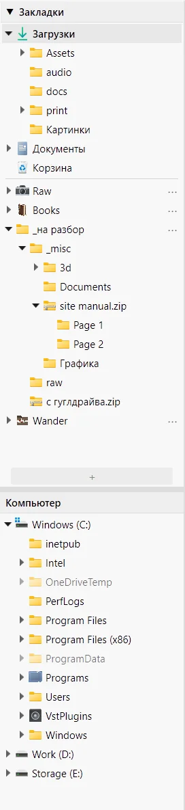

#### Деревья папок

- Клик по строке открывает папку, клик по треугольнику  раскрывает или сворачивает её.
- `Alt`+клик по треугольнику раскрывает папку вместе с подпапками первого уровня, а на раскрытой сворачивает всё поддерево.
- Открытая папка выделена жирным в той панели, откуда её открыли.
- Архивы стоят в дереве среди папок и раскрываются так же.

#### Закладки

- **Добавить**: перетащите папку в зону «+» под закладками.
- **Переставить или убрать**: кнопка `⋯` в строке закладки или правый клик; `Ctrl+↑` и `Ctrl+↓` двигают закладку выше и ниже.
- **Стандартные закладки** стоят сверху: Загрузки, Документы, Изображения, Корзина.
  Рабочий стол, Музыка и Видео включаются в [«Настройки» → «Папки и закладки»](#папки-и-закладки).

Закладка на папку, которой больше нет, становится серой и курсивной; клик по ней предлагает указать новое расположение или убрать закладку.

`Delete` на своей закладке спрашивает, что убрать: закладку или саму папку (в корзину).
На стандартной закладке `Delete` папку не трогает, а только убирает её с панели; вернуть можно в тех же настройках.

#### С клавиатуры

- `Ctrl+1` переводит клавиатуру в текущую панель папок, на открытую папку; повторное нажатие переводит в другую панель (закладки ↔ компьютер).
- Стрелки, `PgUp` / `PgDn` и `Home` / `End` двигают курсор.
- `←` и `→` сворачивают и раскрывают ветку; буквы переводят к папке по началу имени.
- Папка открывается, как только на неё встал курсор; зажатая стрелка открывает только ту, на которой остановились.
  Галочка «Открывать папку, на которую перешли с клавиатуры» стоит в [«Настройки» → «Папки и закладки»](#папки-и-закладки) и в меню правого клика по пустому месту панели; без неё папка открывается по `Enter`.

#### Папка в панели

- Правый клик по папке в дереве или в закладках открывает меню этой папки: «Вставить» кладёт файлы в неё, «Переименовать» переименовывает её.
- `F2` переименовывает папку прямо в панели; открытая папка, история и закладка переходят на новое имя, а `Ctrl+Z` возвращает старое.
- Пока клавиатура в панели, `Delete`, `Ctrl+C`, `Ctrl+V`, `F2` и `Alt+Enter` действуют на папку под курсором.
- Правый клик по пустому месту панели открывает быстрые настройки: скрытые и системные файлы, открытие папки с клавиатуры, вопрос перед удалением, изменения от других программ и «Настройки».

### Архивы как папки

Архивы `.zip`, `.7z`, `.rar` и другие, которые умеет открывать Windows, открываются как папки: путь в адресной строке, выход наверх по `Backspace`, сортировка, поиск по имени, миниатюры снимков.
Это работает, даже если архивы у вас связаны с 7-Zip или WinRAR.
В дереве архив стоит среди папок и раскрывается так же.

**Извлечь файлы** можно так же, как скопировать их из обычной папки:

- скопировать (`Ctrl+C`) и вставить (`Ctrl+V`) в папку или перетащить, в том числе на папку в панели папок; `Ctrl+Z` отменяет извлечение;
- **«Извлечь рядом»** в меню файла или самого архива извлекает без вопросов в папку, где лежит архив; совпавшие имена не заменяются, новое получает «(1)»;
- «Извлечь…» сначала спрашивает папку.

В другие программы файлы из архива тоже уходят обычным копированием или перетаскиванием.

**Просмотр.** Панель просмотра показывает содержимое архива, а файл внутри — как обычный (до 32 МБ).
«Открыть» распаковывает файл во временную копию и запускает его программой; **правки в такой копии в архив не вернутся**.

**Ограничения.** Архив открывается только для чтения: внутри нельзя удалять, переименовывать, переносить и создавать.
Поиск по тексту внутрь архивов не заходит.
У архива с паролем видны имена файлов, но не содержимое, а архив, зашифрованный целиком, выглядит пустым.

## Область файлов

В середине окна отображаются файлы открытой папки.
У области есть тулбар с полем поиска; в папке с оценёнными снимками в нём ещё и фильтр по оценкам, а в галерее — выбор фона.

- [«Виды и сортировка»](#виды-и-сортировка): таблица, плитка, значки, галерея; вид и порядок запоминаются за папкой.
- [«Поиск»](#поиск): по имени и по тексту внутри файлов.
- [«Миниатюры»](#миниатюры): содержимое файлов вместо значков.
- [«Галерея»](#галерея): вид для снимков с оценками и хелперами отсмотра.

**Выделение** работает привычно: клик, `Ctrl`+клик, `Shift`+клик, рамка протяжкой по пустому месту, `Ctrl+A`; первые буквы имени переводят к файлу.
Справа в строке состояния видно, сколько выбрано и сколько это весит; размер папок считает панель просмотра.

Выделенный файл не уходит с экрана: появились новые файлы, изменились фильтр, сортировка или размер окна — он остаётся на виду.

**Что показывать** настраивается в [«Настройки» → «Список файлов»](#список-файлов):

- **скрытые файлы** по умолчанию не видны, включённые рисуются бледнее; вместе с ними можно показать защищённые системные файлы вроде `desktop.ini`;
- **служебные папки и файлы в корне дисков** (`$RECYCLE.BIN`, `System Volume Information`, `pagefile.sys`) держит своя галочка: они остаются скрытыми, даже когда скрытые и системные файлы показаны.
  Включать её незачем — зайти в эти папки всё равно нельзя, они только шумят в списке;
- **файл и его спутники** можно показывать одним элементом, подробнее — на странице [«Файлы-спутники»](#файлы-спутники);
- **изменения от других программ** видны сразу или только по `F5`.

Скрытые и системные файлы включаются и из меню правого клика по пустому месту панели папок.

### Виды и сортировка

Вид переключается в меню «Вид» или клавишами:

| Вид | Клавиши | Что показывает |
|---|---|---|
| Таблица | `Ctrl+Shift+6` | Имя, дату, размер и тип столбцами |
| Плитка | `Ctrl+Shift+7` | Миниатюру и подробности рядом с ней |
| Значки | `Ctrl+Shift+2` | Сетку миниатюр |
| Галерея | `Ctrl+Shift+1` | Крупные снимки для отбора, см. [«Галерея»](#галерея) |

«Вид» и «Сортировка» есть и в меню правого клика по пустому месту папки.

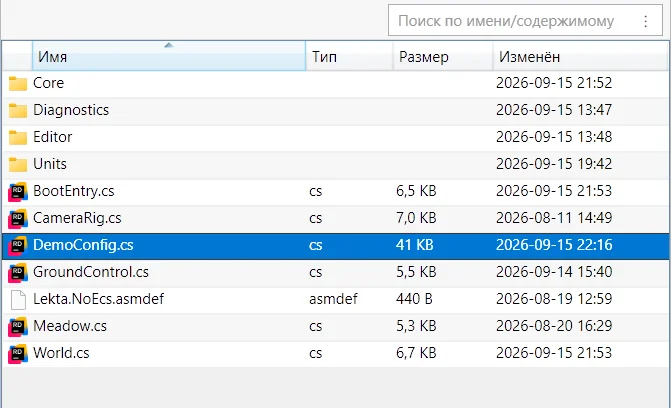

**Вид запоминается за папкой.** Выбрали для папки плитку — она и дальше открывается плиткой.
Остальные папки показываются видом по умолчанию (из коробки — значками), а папки со снимками — галереей.
Первая строка меню «Вид» подсказывает, почему папка показана именно так: «закреплён», «авто: снимки» или «по умолчанию».

- «Автоматически» снимает закрепление с открытой папки.
- «Сделать видом по умолчанию» отдаёт текущий вид всем незакреплённым папкам; вид по умолчанию выбирается и в [«Настройки» → «Вид»](#вид).

**Сортировка**: по имени, дате, размеру, типу или оценке, а также «По возрастанию» и «Папки сверху».
В таблице достаточно щёлкнуть по заголовку столбца, повторный щелчок меняет направление.
Порядок закрепляется за папкой так же, как вид, а «По умолчанию» снимает закрепление; из коробки файлы идут по имени, папки сверху.
Закреплённые вид и порядок переезжают вместе с папкой, когда её переименовывают или переносят.

#### Размеры

`Ctrl`+колесо мыши делает элементы крупнее или мельче; у каждого вида свой размер, и он сохраняется.
`Ctrl`+нажатие на колесо возвращает стандартный размер.
Точные числа задаются в [«Настройки» → «Вид» → «Размеры»](#вид--размеры):

- у таблицы — высота строки и размер значка;
- у плитки — ширина, размер значка и шрифта;
- у значков и галереи — ширина ячейки, размер картинки, отступ и шрифт.

### Поиск

**Быстрый поиск.** Нажмите `Ctrl+F` и вводите имя: файлы открытой папки фильтруются, а ниже отдельной группой появится найденное во вложенных папках.
В таблице добавится столбец «Папка».
`Esc` сбрасывает поиск и возвращает клавиатуру к файлам.

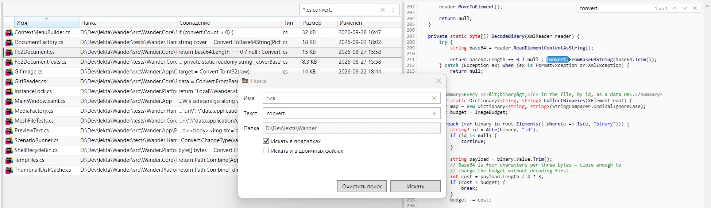

**Маски.** Без `*` и `?` ищется часть имени, с ними — имя целиком по шаблону.
Несколько масок разделяются точкой с запятой.

| Набрано | Найдёт |
|---|---|
| `doc` | всё, где в имени есть «doc» |
| `*.cs` | только `.cs` |
| `*.t*` | расширение на «t» |
| `IMG_?.jpg` | `IMG_1.jpg`, но не `IMG_12.jpg` |
| `*.cs;*.xaml` | и то, и другое |

**Текст внутри файлов** ищется после двоеточия: `*.cs:бюджет` найдёт файлы `.cs` со словом «бюджет», а `:бюджет` — любые файлы с ним.
Всё после первого двоеточия ищется как есть, с пробелами и двоеточиями (`:http://example.com`).
В результатах появится столбец «Совпадение».
Панель просмотра открывает найденный файл сразу на совпадении; `F3` переходит к следующему, а после последнего — к следующему найденному файлу.

**Окно поиска** (`Ctrl+Shift+F` или `⋮` в поле поиска) раскладывает тот же запрос по полям:

- имя или маска;
- текст внутри файлов; имя и текст складываются через **и**, так что `*.cs` плюс слово дадут четыре файла, а не четыреста;
- папка, в которой искать;
- «Искать в подпапках»: в окне по умолчанию снята, и окно ищет только в открытой папке; поле над файлами ищет во вложенных всегда;
- «Искать и в двоичных файлах».

Поле над файлами и окно — один и тот же поиск: набранное в одном видно в другом.

**Поддерживаемые форматы.** Текст в любой кодировке (UTF-8, UTF-16, Windows-1251, DOS-866), `.docx`, `.xlsx`, `.pptx`, `.epub` и OpenDocument; `.doc` и `.rtf` читаются средствами Windows, `.pdf` — если установлена программа для чтения.
Картинки, архивы и программы пропускаются, а с галочкой «Искать и в двоичных файлах» в них ищутся латиница и цифры.

**Результаты** сортируются как обычные файлы.
«Остановить поиск» прерывает его и оставляет найденное, `F5` повторяет поиск, а переход в другую папку сбрасывает.
Индекса нет: файлы читаются при каждом поиске, и на диске ничего не остаётся.

### Миниатюры

В плитке, значках и галерее вместо значков показывается содержимое файлов; в таблице остаются обычные значки.

| Файлы                 | Миниатюра                                                |
|-----------------------|----------------------------------------------------------|
| Картинки, HEIC, RAW   | Само изображение; RAW по встроенному превью              |
| Видео                 | Кадр                                                     |
| Книги FB2 и EPUB, PDF | Обложка или первая страница                              |
| Музыка                | Обложка из файла или картинка рядом (`Cover.jpg`, `folder.jpg`) |
| Папка                 | Обзор содержимого                                        |
| Ярлык                 | Миниатюра того, на что он указывает                      |

Все форматы собраны на странице [«Форматы»](#форматы).

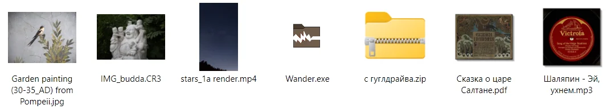

- **Быстродействие**: миниатюры хранятся в кэше, поэтому повторный вход отрисовывается быстрее.
  Размер кэша и память под картинки задаются в [«Настройки» → «Кэш и память»](#кэш-и-память).
- **Актуальность**: миниатюры перечитываются, если файл был изменён.

### Галерея

Вид для картинок и снимков: крупные миниатюры, оценки, настраиваемый фон.
[Хелперы отсмотра](#хелперы-отсмотра) включаются кнопками внизу панели просмотра и рисуются прямо на миниатюрах: фокус-пикинг  показывает, где кадр резкий, уровень резкости  — насколько, а подсветка  — пересветы.
Также работает усиление теней и приглушение светов.
Промах виден ещё до того, как снимок открыт.

- `Enter` открывает снимок на [полный экран](#полный-экран).
- Цифры `1`–`5` ставят [оценку](#оценки-и-метки), `0` снимает её, а `Shift`+цифра ставит цветную метку.
- Фильтр в тулбаре оставляет снимки с нужными звёздами и метками.

Как этим пользоваться при отборе, рассказано на странице [«Отбор снимков»](#отбор-снимков).


**Включается автоматически** в папке, где изображений больше 80 % файлов (RAW считаются; подпапки, спутники и резервные копии — нет), и в папке, которую Windows отмечает как папку изображений.
После выхода из такой папки возвращается обычный вид.
Галочка и порог задаются в [«Настройки» → «Вид»](#вид).
Вид, выбранный вручную, закрепляется за папкой, как любой другой.
Архив со снимками тоже открывается галереей.

**Фон** переключается тремя квадратиками в тулбаре: светлый, серый или тёмный.
Подписи, подсветка и панель просмотра подстраиваются под него.
Яркость серого и тёмного фона задаётся в [«Настройки» → «Вид» → «Галерея»](#вид--галерея).

## Просмотр

Для многих форматов содержимое файла видно сразу, как только он выделен: панель просмотра справа показывает картинки и RAW, видео и музыку с проигрывателем, PDF и документы, код с подсветкой, 3D-модели, содержимое архивов и сведения о программах.
Для папки панель считает, сколько в ней файлов, сколько они весят и какие типы занимают место, а для диска показывает заполнение.

- [«Панель просмотра»](#панель-просмотра): лупа, два снимка рядом, поиск по тексту, данные съёмки.
- [«Полный экран»](#полный-экран): снимки во весь экран, по одному или парой.
- [«Форматы»](#форматы): что Wander умеет с каждым типом файлов.

### Панель просмотра

`Ctrl+Q` или «Вид» → «Панель просмотра» показывает и убирает панель, а её ширина меняется перетаскиванием края.
Внизу панели сводка: имя, размер, дата и данные съёмки, в том числе у RAW.
Для нескольких выделенных файлов сводка показывает, сколько их и что общего у снимков: камера, ISO, диафрагма, выдержка.
Если ничего не выделено, видна сводка по открытой папке.

**Картинки.** Зажатая левая кнопка мыши включает лупу.
Крупное изображение ужимается под панель, мелкое не растягивается.
RAW открывается мгновенно по встроенному превью, а кнопка **RAW** внизу включает полное проявление с матрицы: кадр сменится, когда проявление будет готово, и режим останется включённым для всей папки.

Кнопки внизу панели включают [хелперы отсмотра](#хелперы-отсмотра), в том числе гистограмму  и точку фокуса .

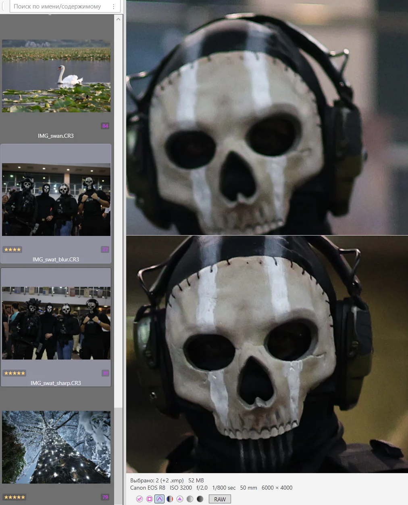

**Два снимка рядом.** Выделите два файла, и панель разделится пополам: снимки встанут друг над другом или рядом, смотря как они выйдут крупнее.
У каждой половины свои звёзды, метка, резкость и гистограмма.

- Лупа (зажатая левая кнопка) на одной половине показывает то же место на второй.
- Если при лупе зажать ещё и правую кнопку, двигается только снимок под курсором — так совмещают кадры со сдвигом.
- При трёх и больше выделенных виден последний добавленный файл, а звёзды внизу ставятся всем.

**Текст и код.** `Ctrl+3` переводит клавиатуру в панель:

- текст выделяется и копируется `Ctrl+C`;
- `Ctrl+F` ищет в тексте, счётчик показывает «3 из 17», а `Enter` и `Shift+Enter` листают совпадения;
- `Esc` возвращает клавиатуру к файлам.

`F3` и `Shift+F3` листают совпадения, не уходя от файлов.
У длинного файла показан первый мегабайт, но совпадения дальше тоже подсчитаны: «Ещё N дальше в файле».

**Видео и музыка** играют во встроенном проигрывателе с паузой, перемоткой, повтором и громкостью; у музыки видны обложка и теги.
Громкость одна для всех файлов и помнится между запусками.
`Ctrl+3` ставит клавиатуру на кнопку воспроизведения.

**Занятый файл.** Если файл держит другая программа и прочитать его нельзя, панель так и пишет и называет эту программу.

Что показывается для каждого типа, собрано на странице [«Форматы»](#форматы).

### Полный экран

Снимки в галерее открываются на полный экран клавишей `Enter` или `Space`: снимок занимает весь экран, стрелки листают папку, а `Esc` или `Enter` возвращают в галерею на последнем показанном снимке.
Листают также колесо мыши и её кнопки «назад» и «вперёд»; зажатая стрелка идёт по папке, показывая каждый снимок.

- Выделено два снимка — они встанут рядом.
- Выделено больше — показываются по одному, стрелки листают только выделенные.
- Если среди выделенных есть не только снимки, `Enter` открывает файлы как обычно.

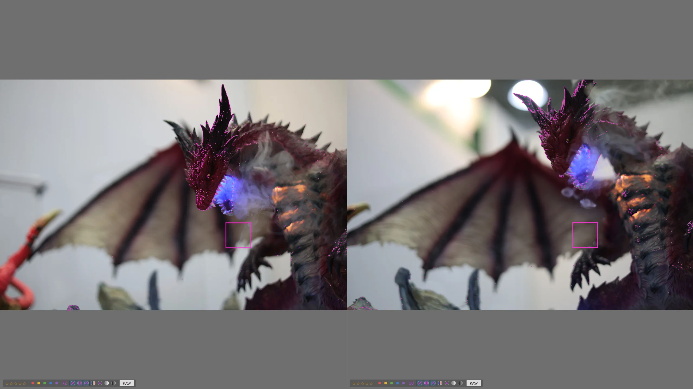

**Сравнение снимков.** `Shift`+стрелка делит экран: слева остаётся показанный снимок, справа появляется соседний, и следующие `Shift`+стрелки, как и `Shift`+колесо, листают правый.
`←` или `→` без `Shift` оставляют на экране левый или правый снимок.

**Полоса снимка.** Внизу снимка, у пары — у каждого, всегда видна полоса, и под лупой тоже: сверху имя файла и балл резкости, ниже звёзды, цветные метки и кнопки [хелперов](#хелперы-отсмотра).
Гистограмма, если включена, стоит в углу снимка.

- Цифры `1`–`5` ставят оценку, `0` снимает её; у пары — снимку под мышью.
- `Delete` отправляет снимок в корзину и показывает следующий.
- `Ctrl+Z` отменяет оценку и удаление.
- `Z` включает лупу 1:1 без кнопки мыши, кадр водится мышью; повторное `Z` выключает её.
  Пока указатель спрятан, лупа встаёт на самое резкое место снимка или на точку фокусировки камеры — выбирается в [«Настройки» → «Вид» → «Галерея»](#вид--галерея).
- Удерживайте `Alt`, чтобы увидеть кадр без подсветки хелперов.

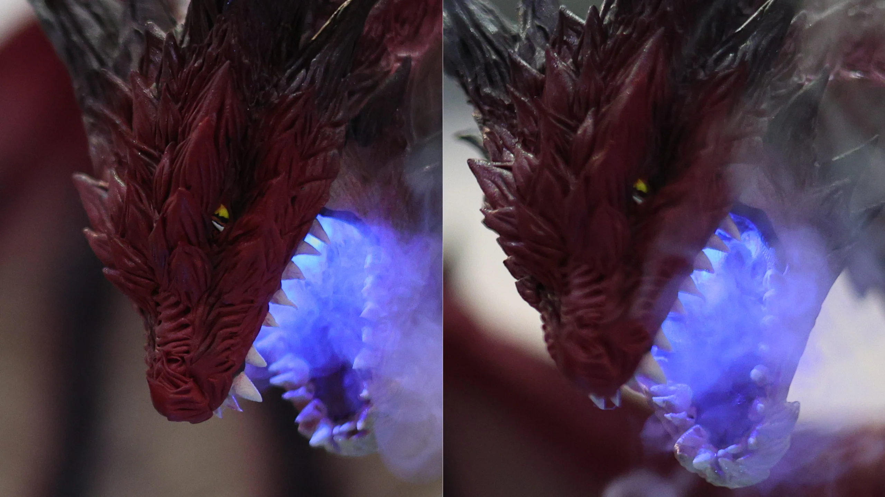

### Форматы

На этой странице собрано, какие форматы поддерживаются и в какой мере.
Пустая ячейка значит «не поддерживается».
Для файлов, которых в таблице нет, вместо миниатюры показывается системный значок, панель просмотра показывает имя, размер и дату, а поиск по тексту читает их, если они похожи на текст.

| Файлы | Миниатюра | Панель просмотра                                                | Полный экран, оценки, хелперы | Поиск по тексту | Конвертация |
|---|---|-----------------------------------------------------------------|---|---|---|
| **Картинки** `.jpg` `.jpeg` `.jpe` `.jfif` `.png` `.gif` `.bmp` `.ico` `.tif` `.tiff` `.webp` `.tga` `.jxr` `.wdp` | картинка | картинка, лупа; GIF и WebP — анимация с плеером                 | да | | в JPEG, в PNG, уменьшить до 1920 — сам Wander; в WebP — ffmpeg |
| **RAW** `.cr2` `.cr3` `.crw` `.nef` `.nrw` `.arw` `.srf` `.sr2` `.raf` `.orf` `.ori` `.rw2` `.rwl` `.pef` `.3fr` `.fff` `.iiq` `.dng` | встроенное превью | превью мгновенно, кнопка **RAW** — декод с матрицы              | да | | превью JPEG из файла — сам Wander; дальше как картинки |
| **HEIC / HEIF** `.heic` `.heif` `.hif` | картинка[^heic] | картинка[^heic]                                                 | да[^heic] | | как картинки |
| **AVIF, JPEG XL** `.avif` `.jxl` | картинка[^avif] | картинка[^avif]                                                 | да[^avif] | | как картинки |
| **SVG** `.svg` | значок | картинка, `</>` — разметка                                      | | как код | |
| **Видео** `.mp4` `.m4v` `.mov` `.wmv` `.avi` `.mkv` `.webm` `.ogv` `.mpg` `.mpeg` `.asf` `.3gp` `.3g2` | кадр | проигрыватель; WebM и OGV пока не проигрываются — конвертируйте в MP4 | | | в MP4 (H.264), сжать, звук в M4A или MP3, кадр в PNG — ffmpeg |
| **Музыка** `.mp3` `.flac` `.m4a` `.m4b` `.aac` `.wav` `.wma` `.ogg` `.opus` `.aif` `.aiff` `.aifc` `.au` `.mka` `.mp2` `.mpa` | обложка | обложка, теги, проигрыватель; OGG и Opus пока не проигрываются  | | | в MP3, M4A, FLAC, WAV — ffmpeg |
| **3D** `.stl` `.obj` `.gltf` `.glb` | значок | модель: вращение, зум                                           | | | |
| **Текст** `.txt` `.log` `.csv` `.tsv` `.ini` `.cfg` `.conf` `.toml` `.env` `.mtl` `.gitignore` `.gitattributes` `.editorconfig` | значок | текст, кодировка определяется сама                              | | да | |
| **Код** — языки, разметка, конфиги, шейдеры и ассеты Unity[^code] | значок | подсветка                                                       | | да | |
| **Markdown** `.md` `.markdown` | значок | отрендеренный документ                                          | | да | в DOCX — pandoc |
| **PDF** `.pdf` | первая страница | документ                                                        | | обработчиком Windows, если стоит читалка | |
| **HTML, MHT** `.html` `.htm` `.mht` `.mhtml` | значок | страница, без доступа к сети                                 | | как текст | |
| **Офисные документы** `.doc` `.dot` `.docx` `.xlsx` `.pptx` `.odt` `.ods` `.odp` | значок | только текст                                                    | | да; `.doc` и `.dot` — обработчиком Windows | в PDF, кроме `.dot`, — LibreOffice; DOCX в Markdown — pandoc |
| **Старые Excel и PowerPoint** `.xls` `.ppt` | значок |                                                                 | | | в PDF — LibreOffice |
| **RTF** `.rtf` | значок | со шрифтами, таблицами, картинками                              | | обработчиком Windows | в PDF — LibreOffice |
| **Книги** `.fb2` `.epub` | обложка | FB2 — обложка, аннотация, текст; EPUB — только текст            | | EPUB — да; FB2 — как текст | |
| **Архивы** `.zip` `.7z` `.rar` `.tar` `.gz` `.tgz` `.bz2` `.xz` и всё, что Windows открывает папкой, например CAB | значок; у картинок внутри — миниатюры | содержимое; файл внутри — как обычный                           | | внутрь не заходит | извлечь |
| **Программы** `.exe` `.dll` `.sys` `.msi` `.ocx` `.scr` `.cpl` `.drv` | свой значок | карточка: версия, компания, подпись                             | | | |
| **Ярлыки** `.lnk` | миниатюра оригинала со стрелкой | содержимое цели                                                 | | | |
| **Спутники** `.xmp` `.pp3` `.meta` | одним элементом с хозяином | оценка и метка; GUID                                            | | | |
| **Папка** | превью содержимого | перепись: файлы, папки, размер, топ типов                       | | | |
| **Диск** | значок | метка, файловая система, заполнение, перепись                   | | | |

[^heic]: Нужны расширения Windows из Microsoft Store; какие именно, сказано в таблице [«Панель просмотра по типам»](#панель-просмотра-по-типам), в строке «HEIC / HEIF».

[^avif]: Нужны расширения Windows из Microsoft Store: для AVIF — HEIF и AV1, для JPEG XL — JPEG XL. Без них вместо миниатюры значок, а панель пишет, что превью нет.

[^code]: `.cs` `.csproj` `.props` `.targets` `.sln` `.slnx` `.js` `.ts` `.jsx` `.tsx` `.mjs` `.cjs` `.py` `.rb` `.go` `.rs` `.java` `.kt` `.swift` `.php` `.c` `.cpp` `.cc` `.cxx` `.h` `.hpp` `.m` `.mm` `.css` `.scss` `.less` `.sh` `.bash` `.zsh` `.ps1` `.bat` `.cmd` `.sql` `.xml` `.xaml` `.json` `.yaml` `.yml` `.diff` `.patch` `.shader` `.cginc` `.hlsl` `.compute`; ассеты Unity `.asset` `.prefab` `.unity` `.mat` — текстом, если проект сериализует их в YAML.

Какие программы нужны для конвертации, рассказано на странице [«Конвертация»](#конвертация), а про оценки и хелперы — в разделе [«Отбор снимков»](#отбор-снимков).

#### Панель просмотра по типам

| Тип | Что показывает, доступные действия |
|---|---|
| Картинки, включая TGA, для которого у Windows нет кодека | Лупа по левой кнопке; крупные ужимаются, мелкие не растягиваются |
| HEIC / HEIF | Картинку в правильном повороте. Если Windows не хватает расширения из Microsoft Store («Расширения для изображений HEIF» — бесплатно; «Расширения для видео HEVC» — платно, если его не поставил производитель компьютера), панель говорит, какого, и кнопка открывает его страницу в Store |
| SVG | Картинку; кнопка `</>` внизу переключает на разметку и обратно. Файл больше 1 МБ сразу показывается разметкой |
| RAW (CR3, CR2, NEF, ARW, DNG…) | Встроенное превью — мгновенно, с поворотом по EXIF. Кнопка **RAW** включает полное проявление с матрицы: превью видно сразу, кадр с матрицы сменяет его, когда готов; режим держится на всю папку |
| GIF, видео | Проигрыватель: воспроизведение и пауза, повтор (у роликов короче трёх секунд включён сразу), перемотка |
| Музыка | Обложку, название, исполнителя, альбом, год, битрейт и проигрыватель. Теги читаются у MP3, FLAC, M4A и M4B, WAV, у остальных — имя и длительность. Обложка берётся из файла, иначе — картинка рядом (`Cover.jpg`, `folder.jpg`, `front.*`, одноимённая или единственная в папке). Русские теги в Windows-1251 читаются правильно |
| 3D (STL, OBJ, glTF, GLB) | Модель: тянуть — вращать, колесо — приблизить; внизу число треугольников и вершин. Цвет берётся из `.mtl` и glTF, текстуры не подтягиваются. FBX, DAE, DXF не поддерживаются |
| Текст | Кодировка определяется сама, включая 1251 и 866. Большой файл показывается с начала, внизу написано «… показано начало файла, всего 12 МБ» |
| Код | Подсветку: обычные языки, bat и cmd, sh, шейдеры Unity, YAML и ассеты Unity, `.diff` и `.patch` |
| PDF, HTML, MHT, Markdown | Готовый документ; в Markdown — таблицы, `- [x]`, `~~зачёркнутое~~`, ссылки и сноски. В сеть панель не ходит: внешние картинки и скрипты не загружаются |
| FB2, RTF | Обложку, название, авторов, аннотацию и текст (длинная книга — с начала); RTF — со шрифтами, таблицами и картинками |
| Word, Excel, PowerPoint, OpenDocument, EPUB | Текст документа с пометкой «Только текст — форматирование не разобрано» |
| Программы и библиотеки | Карточку: версия, продукт, компания, платформа (x64, консольная, .NET…), подпись — чья и действительна ли, авторские права. Подпись проверяется чуть позже остального, у файла больше 200 МБ — по кнопке «Проверить» |
| Ярлык `.lnk` | Содержимое цели; внизу имя оригинала и «Перейти к оригиналу». Про битый ярлык так и написано |
| Диск | Метку, файловую систему, полосу заполнения (жёлтая с 85 %, красная с 95 %) и перепись |
| Папка | Перепись: файлы, папки, размер, самые объёмные типы с полосками. Числа растут по ходу обхода, уход из папки его прерывает |

## Работа с файлами

Копирование, перенос, переименование и удаление работают привычно, теми же клавишами, что и везде в Windows.
Буфер обмена общий с системой, а перетаскивание работает между Wander и любыми программами в обе стороны.

| Клавиши | Что делают |
|---|---|
| `Ctrl+C` / `Ctrl+X` / `Ctrl+V` | Копировать / вырезать / вставить |
| `F2` | Переименовать; на нескольких файлах — [группой](#групповое-переименование) |
| `Delete` / `Shift+Delete` | В корзину / навсегда |
| `Ctrl+Shift+N` | Новая папка |
| `Ctrl+Z` | Отменить |

Wander бережёт файлы:

- **отменяется почти всё**: копирование, перенос, переименование, удаление в корзину, новая папка, ярлык, оценка; не отменяются удаление навсегда и [своё действие](#свои-действия) без файла результата;
- **конфликты имён решаются в одном окне** до внесения изменений, с миниатюрами и сравнением, см. [«Решение конфликтов»](#решение-конфликтов);
- **длительные операции идут в фоне**, каждая в своём окне с прогрессом и отменой, не блокируя работу, см. [«Длительные операции»](#длительные-операции);
- **спутники следуют за файлом** (`.xmp`, `.meta`): переносятся, копируются и удаляются вместе с ним, см. [«Файлы-спутники»](#файлы-спутники).

Буфер и перетаскивание описаны на странице [«Копирование и перенос»](#копирование-и-перенос), корзина и удаление навсегда — на странице [«Удаление и корзина»](#удаление-и-корзина).

**Новая папка**: `Ctrl+Shift+N` или «Создать» → «Папка» в меню пустого места.
Папка появляется сразу с полем для имени.

**Переименование**: `F2` открывает имя для правки на месте, `Enter` применяет, `Esc` отменяет.
На нескольких файлах `F2` открывает [групповое переименование](#групповое-переименование).

**Отмена.** `Ctrl+Z` отменяет последнюю операцию, следующее нажатие — предыдущую:

- перенесённое возвращается на место, переименованное — к прежнему имени;
- удалённое достаётся из корзины, а созданное уходит в корзину.

Долгий откат показывает прогресс, и его можно остановить.
Файл, который вернуть не удалось, не мешает остальным, строка состояния назовёт его.
История отмены живёт до закрытия Wander (удалённое при этом остаётся в корзине) и не касается чужих операций: если вырезать файл здесь и вставить в другой программе, перенос выполнит та программа.
После удаления навсегда из истории уходит только то, что касалось удалённого: его перенос или переименование уже не отменить, остальное `Ctrl+Z` отменяет как прежде.
Пока идёт длительная операция, `Ctrl+Z` не срабатывает.

**Подтверждения.** Удаление и перемещение спрашивают подтверждение, и по умолчанию в вопросе выбрана «Отмена».
Вопросы перед удалением в корзину и перед перемещением можно отключить в [«Настройки» → «Файловые операции»](#файловые-операции): `Ctrl+Z` всё равно всё вернёт.
Удаление навсегда спрашивает всегда.

**Защита системных папок.** Нельзя удалить, перенести или переименовать `C:\Windows` со всем содержимым, а также сами корни дисков, `Program Files`, `ProgramData`, папку пользователей и папки профиля, которые ведёт Windows (Рабочий стол, Документы, Загрузки и другие).
То, что лежит внутри них, — ваше; закрыта целиком только `C:\Windows`: внутрь неё Wander ничего и не создаёт — ни папку, ни распакованный архив, ни результат действия, строка состояния скажет об отказе.

**Занятый файл.** Wander называет программу, которая держит файл: «открыт в: Word (PID 1234)».
Если из-за этого файл не удалось удалить, появится окно «Файл занят» с кнопкой «Повторить»: закройте файл в той программе и повторите.
Видео и PDF, открытые в панели просмотра, Wander отпускает сам.
Файлы, над которыми идёт операция, помечены на значке часами.

### Копирование и перенос

**Буфер обмена** системный: скопированное в Wander вставляется в других программах, и наоборот.
Если вставить файл в ту же папку, откуда он скопирован, рядом появится копия «имя (1)».

**Текст или картинка из буфера** вставляются файлом: `Ctrl+V` создаёт в папке `Текст.txt` или `Изображение.png` (например, из ячеек Excel или из снимка «Ножниц») и сразу предлагает его переименовать.
Вложения писем и файлы с телефона система передаёт не файлом, а содержимым; такое Wander пока вставить не может и сообщает об этом.

**Перетаскивание левой кнопкой** в пределах одного диска переносит файлы, а между дисками копирует.
Клавиши меняют действие:

- с `Shift` — перенос;
- с `Ctrl` — копирование;
- с `Alt` — ярлык.

Если задержать файлы над свёрнутой папкой в панели папок, она раскроется.
Папка среди файлов при этом не открывается; чтобы открывалась, включите «Входить в папку, если задержать над ней перетаскиваемый файл» в [«Настройки» → «Файловые операции»](#файловые-операции).
У края окна файлы прокручиваются сами, тем быстрее, чем дальше за край.
Папки можно тащить и из дерева.

**Перетаскивание правой кнопкой** после броска открывает меню: копировать, переместить, создать ярлыки, а также «Конвертировать» и «Частные» — их результат сразу ляжет в эту папку.
Жирным выделено то, что сделал бы обычный бросок.

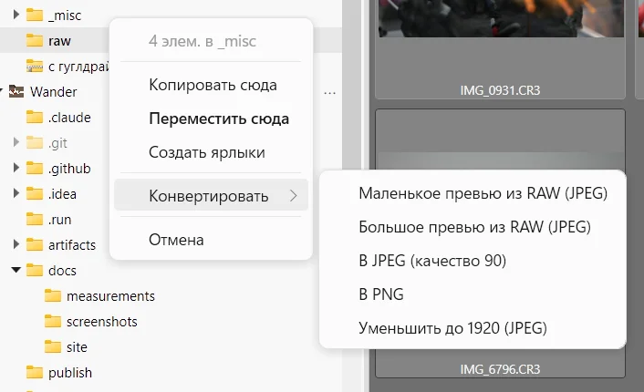

### Удаление и корзина

`Delete` отправляет файлы в корзину Windows, а `Ctrl+Z` достаёт их обратно.
`Shift+Delete` удаляет навсегда, мимо корзины: из собственных операций Wander не отменяется только эта, поэтому она всегда спрашивает подтверждение.
Из истории отмены при этом уходит то, что касалось удалённых файлов, остальное остаётся.
Пункта «Удалить безвозвратно» в меню нет намеренно.

**Корзина** открывается прямо в Wander стандартной закладкой слева.
Видно, откуда и когда удалён файл; «Восстановить» стоит первым пунктом меню и работает сразу на нескольких файлах.
Остальные операции в корзине выключены, а очищать её нужно средствами Windows.

**Если файл не помещается в корзину** (у него путь длиннее 259 символов или он лежит на диске без корзины), Wander не удаляет его молча: остальное уходит в корзину, а про такие файлы приходит вопрос со списком имён: «Удалить безвозвратно» или «Прервать».
По умолчанию выбрано «Прервать».

**Замена тоже обратима.** Файл, заменённый при копировании, уходит в корзину, и `Ctrl+Z` возвращает обе стороны.

### Решение конфликтов

Когда вы копируете или переносите файлы в папку, где уже есть файлы или папки с теми же именами, Wander не спрашивает про каждый по очереди.
Он показывает **одно окно на всю операцию** ещё до того, как тронет хоть один файл, и в нём сразу решаются все совпадения имён.

Каждая пара занимает строку: слева то, что копируется, справа то, что уже лежит на месте, у обоих миниатюра, размер и дата.
Больший и более свежий файл выделены жирным.
Одинаковые файлы Wander сверяет побайтово и так и пишет: «Файлы идентичны».

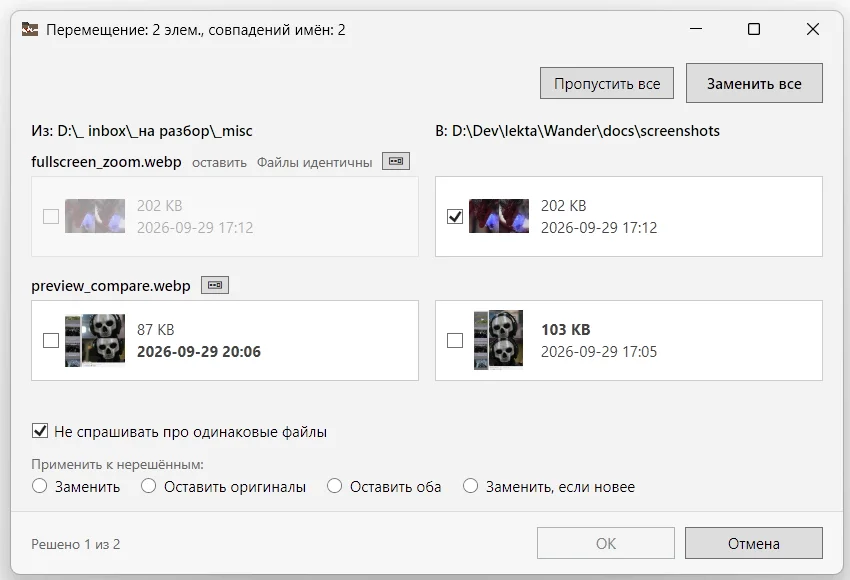

Галочка у стороны значит, что эта сторона останется:

| Отмечено | Что будет |
|---|---|
| Слева | Заменить: то, что лежит на месте, уйдёт в корзину |
| Справа | Оставить как есть; при переносе файл останется, где был |
| Обе | Оставить оба: копия получит имя «имя (1)», папки сольются |

**Слияние папок.** Если на паре папок отмечены обе галочки, ниже появятся совпадения внутри них, и каждое решается отдельно.
Если отмечена только левая, папка заменится целиком.

**Быстрые ответы.**

- «Заменить все» и «Пропустить все» наверху справа решают весь список сразу и закрывают окно.
- Под списком выбирается ответ для ещё не решённых пар: заменить, оставить оригиналы, оставить оба или заменить, если новее.
- Галочка «Не спрашивать про одинаковые файлы» по умолчанию включена, её начальное состояние задаётся в [«Настройки» → «Файловые операции»](#файловые-операции).

**Сравнить.** Кнопка  у имени пары открывает оба файла рядом: тексты с общей прокруткой, картинки рядом или наложением (`Space` переключает); лупа показывает одно и то же место на обеих.

Кнопка «ОК» становится доступна, когда решены все пары; `Esc` отменяет всю операцию, и к этому моменту ещё ничего не сделано.
Ошибиться не страшно: заменённые файлы лежат в корзине, и `Ctrl+Z` вернёт всё.

### Длительные операции

Копирование, перенос, удаление и извлечение идут в фоне.
Если операция занимает больше мгновения, у неё появляется своё окно: имя текущего файла, «Файлов: N из M», объём, скорость и сколько осталось.
Wander при этом работает как обычно: можно переходить по папкам и запускать другие операции.

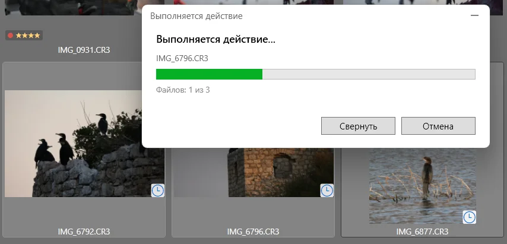

- **«Свернуть»** убирает окно в строку состояния: «Копирование: 45 %», у нескольких операций — общая полоса.
  Клик по ней открывает список операций с кнопками «Показать» и «Отмена».
  Закрыть окно до конца операции нельзя, чтобы она не потерялась; по завершении оно закрывается само.
- **«Отмена»** останавливает операцию сразу, а не в конце текущего файла: недописанный файл не остаётся, а то, что успело скопироваться, убирает `Ctrl+Z`.
- **Выход из Wander** во время операции спрашивает, прервать ли её; по умолчанию выбрана «Отмена».

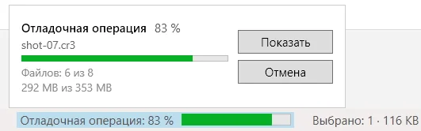

### Файлы-спутники

Спутник — файл, который описывает другой файл: `Sprite.png.meta` у Unity, `IMG.CR2.xmp` или `IMG.CR2.pp3` у снимка.
Wander показывает его одним элементом с основным файлом, а переносит, копирует, переименовывает и удаляет вместе с ним; `Ctrl+Z` возвращает всю группу.
Дубликаты darktable (`IMG_01.CR2.xmp`, `IMG_02.CR2.xmp`) тоже едут со снимком, пока рядом нет файла `IMG_01.CR2`.

| Спутник | Что видно в панели просмотра |
|---|---|
| Unity `.meta` | GUID с кнопкой «Копировать», тип импортёра |
| `.xmp`, `.pp3` | Оценка и цветная метка; их можно менять — правится одна строка файла, остальное не трогается |

`IMG.xmp` рядом с `IMG.CR2` и `IMG.jpg` считается спутником RAW: перенос JPEG его не уносит.
Если рядом два JPEG или два RAW с одним именем, спутник остаётся отдельным элементом — угадывать хозяина Wander не берётся.

Чтобы видеть спутники отдельными файлами, снимите «Показывать файл и его спутники одним элементом» в [«Настройки» → «Список файлов»](#список-файлов).

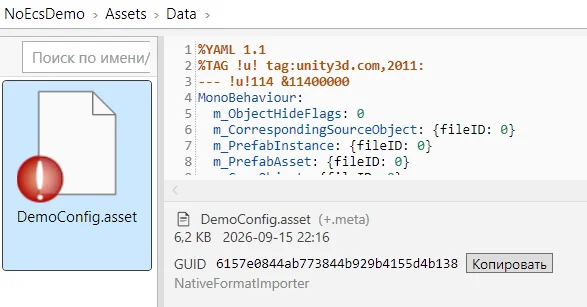

## Отбор снимков

Весь отсмотр съёмки можно быстро сделать в Wander, без редактора: найти промахи, сравнить дубли, расставить оценки и оставить лучшее, рассортировать и обработать то, что не требует внимания.
Оценки пишутся в файлы-спутники рядом со снимками, их понимают программы Adobe, darktable и RawTherapee.


1. **Откройте папку** со снимками — она станет [галереей](#галерея) с крупными миниатюрами, а RAW будут отображаться по встроенному превью.
   Тёмный или серый фон выбирается в тулбаре.
2. **Отсейте промахи.** Включите [хелперы](#хелперы-отсмотра) кнопками внизу панели просмотра: фокус-пикинг  и резкость  появятся прямо на миниатюрах, а клиппинг  покажет пересвет.
3. **Сравните** похожие кадры: выделите два, и в панели просмотра они встанут рядом, а лупа покажет одно место на обоих.
   `Enter` откроет пару [на полный экран](#полный-экран), а `Shift`+стрелка сравнит снимок с соседним.
4. **Оцените**: цифры `1`–`5` ставят звёзды выделенным снимкам, `Shift`+цифра — цветную метку, `0` снимает оценку, а `Ctrl+Z` отменяет.
   Подробнее — на странице [«Оценки и метки»](#оценки-и-метки).
5. **Отберите лучшее**: фильтр со звёздами в тулбаре покажет отобранные снимки.
6. **Сразу разложите и сконвертируйте отобранное.** Выделите отфильтрованные снимки (`Ctrl+A`) и перетащите их **правой кнопкой** на другую папку — в дереве, в закладках или среди файлов.
   В меню на месте броска их можно скопировать или перенести, а можно выбрать «Конвертировать», например превью из RAW в JPEG: результат ляжет в эту папку, а исходники останутся на месте.
   Подробнее — на странице [«Конвертация»](#конвертация).

### Оценки и метки

Каждому снимку можно поставить от одной до пяти звёзд и цветную метку.
В галерее и значках они видны в углу миниатюры, в плитке — звёздами во второй строке, в таблице — в столбце «Оценка», по которому можно сортировать.

**Как поставить.**

- В галерее цифры `1`–`5` ставят звёзды всем выделенным снимкам, `0` снимает оценку.
  `Shift`+цифра ставит цветную метку, повтор той же снимает её.
- Мышью оценка ставится звёздами и кружками меток внизу панели просмотра.
  При нескольких выделенных она ставится всем (рядом написано «и ещё N»), в паре и на полном экране — каждому снимку своя.
- В других видах цифры набирают имя файла, поэтому там оценки ставятся мышью.

Звёзды и метка не зависят друг от друга.
Пачка оценок отменяется одним `Ctrl+Z`.
Файлы при этом не перескакивают: при сортировке по оценке они встанут по местам после `F5`.

**Фильтр** в тулбаре файлов появляется в папке, где есть оценённые снимки, работает во всех видах и сбрасывается при переходе в другую папку.

- Клик по звезде оставляет снимки с этой оценкой и выше, а `Ctrl`+клик добавляет или убирает одну оценку.
  Например, чтобы оставить только четвёрки, нажмите `Ctrl`+клик на четвёртой звезде в пустом фильтре.
- Перечёркнутая звезда оставляет снимки без оценки.
- С цветными метками всё так же.
- Кнопка сброса ↺ снимает фильтр.

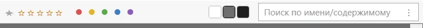

**Где хранится оценка.** В файле-спутнике рядом со снимком: `.xmp` (Adobe, darktable, exiftool) или `.pp3` (RawTherapee); сам снимок не меняется.
Если спутников с оценкой два, она читается из файла программы (`IMG.CR2.xmp` darktable или `IMG.CR2.pp3`), а не из `IMG.xmp`, новая же пишется в оба; подсказка у звёзд называет файлы.
У снимка без спутника звёзды приглушены, и первая оценка создаёт такой файл.
Перед этим Wander спрашивает; вопрос можно отключить в [«Настройки» → «Файловые операции» → «Оценки»](#файловые-операции--оценки).
`Ctrl+Z` удаляет созданный файл.

**Оценка из камеры.** Звёзды, поставленные в камере, а также Проводником или при экспорте, Wander читает из самого снимка: RAW, JPEG, TIFF, HEIC.
Они выглядят как обычные и так же участвуют в фильтре и сортировке; подсказка у звёзд говорит, что оценка из снимка.
Сам снимок Wander не меняет: новая оценка ляжет в спутник, и снять оценку камеры тоже можно — Wander создаст спутник с нулём, спросив, как при создании.
Оценка в спутнике главнее оценки в снимке.

**`.xmp` или `.pp3`.** По умолчанию Wander создаёт `.xmp`: он не влияет ни на что, кроме оценки.
`.pp3` — файл настроек RawTherapee: как только он появляется рядом со снимком, RawTherapee перестаёт применять к нему профиль проявки по умолчанию, даже если в файле одна строка.
Оценки из `.xmp` RawTherapee читает с версии 5.7 и синхронизирует с версии 5.11.
Переключиться на `.pp3` можно на той же странице настроек.

### Хелперы отсмотра

Кнопки внизу панели просмотра, слева от **RAW** (на полном экране — в углу снимка), подсвечивают то, по чему отбирают снимки: где резко, что пересвечено, что прячется в тенях.
Их можно включать в любом сочетании, и они остаются включёнными, пока Wander открыт; включённая кнопка обведена двойной рамкой.
Удерживайте `Alt`, чтобы увидеть кадр без подсветки.
Название кнопки показывается в подсказке.

| Кнопка | Что показывает                                                                                                                                                                                                                  |
|---|---------------------------------------------------------------------------------------------------------------------------------------------------------------------------------------------------------------------------------|
|  | **Фокус-пикинг**: чёткие грани кадра розовым — там, где действительно резко. Считается по полному кадру, в лупе рисуется 1:1. Отдельные точки (снег, блики, зерно) отбрасываются: фокус — это линии                             |
|  | **Точка AF**: рамка, по которой фокусировалась камера (Canon). Камера иногда записывает её неточно, поэтому сверяйтесь с пикингом                                                                                               |
|  | **Резкость** от 0 до 100 по середине кадра. Число видно рядом с датой съёмки, в углу ячейки галереи, а в паре и на полном экране — рядом со звёздами. 70 и выше — резко, 45–70 — мягко, ближе к нулю — так я вижу мир без очков |
|  | **Клиппинг**: пересвет цветом канала (красный, зелёный, синий или их смесь; белый — все три), недосвет синим                                                                                                                    |
|  | **Гистограмма** по каналам; в паре и на полном экране у каждого снимка своя. Яркая полоса у края показывает, сколько кадра ушло в недосвет (слева) и в пересвет (справа), проценты — в подсказке                                |
|  | **Тени**: кадр с поднятыми тенями — видно, что скрывается в тени                                                                                                                                                                |
|  | **Света**: кадр с приглушёнными светами — видно, что можно спасти от пересвета                                                                                                                                                  |

**На миниатюрах.** В галерее фокус-пикинг, точка AF, клиппинг, тени и света рисуются прямо на миниатюрах, а резкость стоит числом в углу, так что промахи видны по всей папке сразу.
Считается только то, что сейчас на экране.

- В режиме **RAW** пикинг ждёт полного проявления с матрицы и меряет по нему.

## Действия и меню

С выделенными файлами работают два меню.

- **Контекстное меню** (правый клик) в стиле Windows 10: все пункты сразу, включая пункты других программ вроде 7-Zip, TortoiseGit и Notepad++.
  Подробнее — на странице [«Контекстное меню»](#контекстное-меню).
- **Меню «Действия»** в шапке окна: то, что Wander делает сам.
  Его первая строка говорит, к чему применится действие: «3 CR3», «4 изображения», «5 файлов», «2 папки», «7 элементов», имя единственного файла или «Папка: D:\Фото», если ничего не выделено.

В меню «Действия»:

- «Переименовать группой…», см. [«Групповое переименование»](#групповое-переименование);
- «Частные» — ваши действия: открыть в своей программе, запустить скрипт, см. [«Свои действия»](#свои-действия);
- «Конвертировать» — видео, музыка, картинки, документы, превью из RAW, см. [«Конвертация»](#конвертация);
- «Извлечь рядом» и «Извлечь…» для архивов;
- «Создать ярлык», «Копировать путь», «Открыть в терминале».

В меню показывается только то, что подходит к выделенному.
«Частные» и «Конвертировать» есть и в контекстном меню, а при перетаскивании правой кнопкой на папку их результат сразу ложится туда.
Лишние пункты из обоих меню можно убрать в [«Настройки» → «Файловые операции» → «Контекстное меню»](#файловые-операции--контекстное-меню).

### Контекстное меню

Меню правой кнопки показывает весь список сразу, без «Показать дополнительные параметры».

- Сверху частое: «Открыть», «Открыть с помощью», пункты других программ с их значками и подменю.
- Внизу подменю **«Файл»**: вырезать, копировать, вставить, копировать путь или имя, переименовать, создать ярлык, удалить, а также «Отправить» и другие файловые пункты Windows.
- Повторяющиеся пункты убраны.

С клавиатуры меню открывают `Shift+F10` или клавиша меню.

Правый клик по пустому месту открывает меню папки: «Создать» (новая папка с отменой и вводом имени, дальше шаблоны Windows), «Вид», «Сортировка», «Открыть в терминале» (Windows Terminal в этой папке, а без него PowerShell), «Копировать путь» и «Свойства».

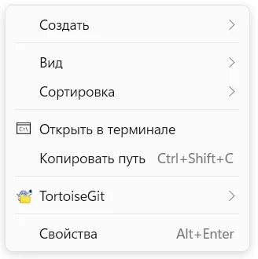

Первый правый клик в новой папке может открыть меню с задержкой, пока отвечают расширения других программ; дальше меню открывается сразу.

#### Настройка

Меню настраивается в [«Настройки» → «Файловые операции» → «Контекстное меню»](#файловые-операции--контекстное-меню):

- **«Пункты других программ»** выключаются целиком: тогда их расширения не загружаются, и меню открывается быстрее;
- **по одному** пункты выключаются в таблице, где видны пункт, программа и типы файлов.
  Строка с именем программы («7-Zip») отвечает за весь её раздел.
  Поиск над таблицей находит по пункту, программе и типу файла (`.mp4`).
  В таблице то, что уже встречалось в меню, а «Добавить программу или тип файла…» показывает пункты, не дожидаясь меню;
- **«Основные пункты»** — то, что рисует сам Wander: открыть, копировать, свойства, «Открыть в терминале», свои действия, «Вид» и «Сортировка» в меню пустого места.
  Снятая галочка убирает пункт из меню, а сочетание клавиш продолжает работать.

«Сбросить настройки контекстного меню…» внизу страницы возвращает всё как было.

### Групповое переименование

Нажмите `F2` на двух и более файлах или выберите «Действия» → «Переименовать группой…».
Переименовать за раз можно либо только файлы, либо только папки.

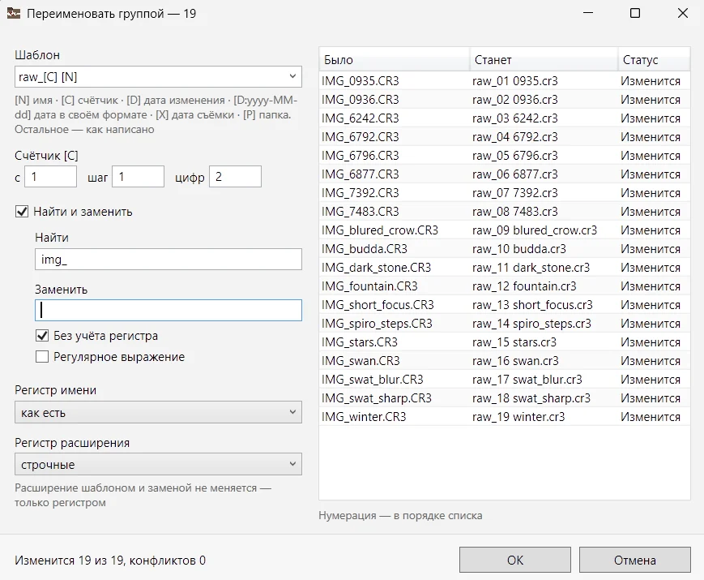

**Шаблон** собирает новое имя из текста и токенов:

| Токен | Что подставляется |
|---|---|
| `[N]` | прежнее имя |
| `[C]` | счётчик; с какого числа, шаг и сколько цифр — в полях под шаблоном |
| `[D]` | дата изменения; `[D:yyyy-MM-dd]` — в своём формате |
| `[X]` | дата съёмки из EXIF, а у файла без неё — дата изменения |
| `[P]` | имя папки |

Например, `[P]_[C]` с тремя цифрами счётчика в папке «Отпуск» даст `Отпуск_001`, `Отпуск_002` и так далее.

Под шаблоном:

- **«Найти и заменить»** без учёта регистра, можно регулярным выражением (`$1` в замене — первая группа);
- регистр имени и расширения; само расширение меняется только регистром.

Справа таблица **«было → станет»**: конфликт выделен красным, неизменные имена — серым.
Нумерация идёт в том порядке, в каком файлы стоят на экране.
Применяет изменения только кнопка «ОК», а `Ctrl+Z` возвращает все имена разом.
Имена можно менять местами — Wander разведёт их сам.
Пять последних шаблонов и правила запоминаются.

### Конвертация

«Действия» → «Конвертировать» — готовые преобразования.
Выделите файлы и выберите пункт: результат ляжет рядом с исходным под новым именем, а исходный файл не изменится.
`Ctrl+Z` убирает результат в корзину.

| Для чего | Что | Нужно |
|---|---|---|
| RAW | Маленькое и большое превью — JPEG, который камера положила внутрь файла | ничего |
| Изображения | В JPEG (качество 90), в PNG, уменьшить до 1920 по длинной стороне | ничего |
| Изображения | В WebP | FFmpeg |
| Видео | В MP4 (H.264); сжать в `_small.mp4`; звук в M4A или MP3; кадр в PNG | FFmpeg |
| Аудио | В MP3, M4A, FLAC, WAV | FFmpeg |
| Документы | В PDF | LibreOffice |
| Markdown, DOCX | Markdown в DOCX, DOCX в Markdown | Pandoc |

Пункт, для которого не хватает программы, виден серым, а подсказка называет эту программу.

**В другую папку.** В конце подменю есть «В другую папку…»: Wander спросит папку, и результаты всей пачки лягут туда.
То же одним жестом: перетащите файлы **правой кнопкой** на папку в области файлов, в дереве или в закладках и выберите преобразование в меню на месте броска.

**Имя результата** строится рядом с исходным по шаблону: `clip.mp4` станет `clip_small.mp4`.
Если имя занято, добавляется номер: рядом с «clip (3)» появится «clip (4)».
Ничего не перезаписывается.

**Ход конвертации** виден в окне операции, как при копировании, с отменой; недописанный результат уходит в корзину.
Если что-то не получилось, появится окно со строкой на каждый файл и сообщением программы.

#### Программы

FFmpeg, LibreOffice и Pandoc Wander находит сам — в `PATH` и в обычных местах установки.
В [«Настройки» → «Файловые операции» → «Программы»](#файловые-операции--программы) видно, найдена ли каждая и где она лежит.
**«Указать…»** выбирает exe вручную, **«Сбросить»** возвращает автоматический поиск.
Если программа не найдена, там же есть строка для её установки, которую можно скопировать: `winget install Gyan.FFmpeg`, `TheDocumentFoundation.LibreOffice`, `JohnMacFarlane.Pandoc`.

#### Картинки

Картинки Wander перекодирует сам:

- снимок разворачивается по EXIF и дальше лежит ровно;
- дата съёмки, камера, выдержка, диафрагма, ISO, фокусное расстояние, координаты, рейтинг и копирайт переносятся в JPEG и TIFF, в том числе из RAW; название, ключевые слова и автор — когда их отдаёт Windows, а из `.xmp` рядом со снимком не переносятся;
- JPEG, который не нужно ни уменьшать, ни поворачивать, не пережимается;
- прозрачные области в JPEG заливаются белым, а PNG, BMP и GIF метаданных не хранят;
- RAW, который Windows не открывает, конвертируется из встроенного в него JPEG.

**Превью из RAW** — встроенный JPEG как есть, без пережатия, поэтому быстро.
**Большое** (`IMG_lpv.jpg`) — самое крупное, что положила камера (у CR3, CR2 и ARW это полный кадр), **маленькое** (`IMG_spv.jpg`) есть только у CR3, 1620×1080.
Поворот, камера, дата съёмки и координаты записываются в файл.

### Свои действия

Свои пункты меню: «Открыть в Notepad++», «Упаковать в 7-Zip», любой скрипт.
Они настраиваются в [«Настройки» → «Файловые операции» → «Действия»](#файловые-операции--действия): сверху таблица действий, под ней карточка выбранного.
«Добавить» создаёт новую строку, «Дублировать» — копию.
Встроенные конвертации тоже здесь: их не правят, а выключают галочкой или дублируют и правят копию.

В карточке:

- **название**: как пункт выглядит в меню;
- **для каких файлов**: группа (изображения, видео, аудио, текст и код, документы, архивы, папки, всё) или маска `*.psd;*.ai`, которая главнее группы.
  Действие предлагается, только когда подходят **все** выделенные файлы, а действие для папок без выделения работает на открытую папку;
- **программа**: из списка уже используемых или своя, кнопкой с папкой (`.exe`, `.cmd`, `.bat`);
- **аргументы** с подстановками (ниже);
- **режим**: «на каждый файл» (по процессу на файл, по очереди) или «все одной командой»;
- **где показывать**: «оба меню», «контекстное» или «шапка» (меню «Действия»); **в подменю** — внутри подменю «Частные» или отдельным пунктом;
- **показывать консоль**: по умолчанию программа запускается без окна, а её сообщение об ошибке Wander показывает сам;
- **файл результата** (ниже).

Действие, которое в таком виде не сработает (нет программы, аргументы не подходят к режиму), отмечено в таблице красным, а карточка объясняет, что не так.

**Подстановки** в аргументах; кавычки ставятся сами:

| Подстановка | Что подставляется |
|---|---|
| `{path}` | файл |
| `{name}` | его имя без расширения |
| `{ext}` | расширение без точки |
| `{dir}` | папка файла |
| `{paths}` | все выделенные файлы, для режима «все одной командой» |
| `{list}` | временный файл со списком путей, по одному в строке |
| `{out}` | файл результата |
| `{outdir}` | пустая папка для программы, которая называет результат сама |

Пример: для «Открыть в Notepad++» программа — `C:\Program Files\Notepad++\notepad++.exe`, аргументы — `{path}`.

**Файл результата** задаётся шаблоном имени рядом с исходным: `{name}.mp4`, `{name}_small.mp4`.
Занятое имя получает номер, ничего не перезаписывается, а `Ctrl+Z` убирает результат в корзину.
Действие без файла результата отменить нельзя: что сделала программа, Wander не знает.

Программе, которая сама выбирает имя и заменяет чужой файл (так делает LibreOffice), дайте вместо папки `{outdir}`: она запишет результат в пустую папку, а Wander перенесёт файл с именем результата к исходному, по тем же правилам.
Работает в режиме «на каждый файл».

**Встроенный кодировщик изображений** выполняет встроенные конвертации картинок, и его можно выбрать в своём действии.
Его аргументы — настройки через точку с запятой:

- `format=jpeg` (или `png`, `bmp`, `tiff`, `gif`) — обязательно;
- `quality=1…100` — качество JPEG, по умолчанию 90;
- `maxside=` — длинная сторона в пикселях;
- `source=preview` или `preview-full` — взять JPEG, который камера положила в RAW: маленький или самый крупный.

Пример: `format=jpeg;quality=85;maxside=1920` с файлом результата `{name}_1920.jpg`.

## Справочник

Всё, что удобнее находить, чем читать подряд:

- [«Горячие клавиши»](#горячие-клавиши): все сочетания и жесты мыши;
- [«Настройки»](#настройки): каждая страница настроек, пункт за пунктом;
- [«Данные и кэш»](#данные-и-кэш): где Wander хранит настройки, миниатюры и логи;
- [«Командная строка»](#командная-строка): ключи запуска, открытие папки, портативный режим.

Если что-то не работает, загляните на страницу [«Проблемы и отчёты»](#проблемы-и-отчёты).

### Горячие клавиши

Похожий список, короче и с поиском по сочетанию и по действию, есть в [«Настройки» → «Клавиатура»](#клавиатура).

**Области окна.** `Tab` и `Shift+Tab` переключают области: кнопки навигации → адресная строка → закладки → дерево → поле поиска → файлы; активная область обведена рамкой.
`Ctrl+1`, `Ctrl+2` и `Ctrl+3` сразу переводят клавиатуру в панель папок, к файлам и в панель просмотра.
`Esc` откуда угодно возвращает клавиатуру к файлам.
После операций и окон клавиатура остаётся там, где была: после удаления выделен следующий файл, после вставки — вставленный.

#### Навигация

| Клавиши | Действие                                                         |
|---|------------------------------------------------------------------|
| `Alt+←` / `Alt+→` | Назад / вперёд по истории посещений                              |
| `Alt+↑`, `Backspace` | На уровень вверх                                                 |
| `Enter` | Открыть выбранное: папку — войти, файл — программой по умолчанию |
| `Ctrl+L`, `Alt+D` | Правка пути в адресной строке, текст выделяется целиком          |
| `F4` | Список последних папок                                           |
| `Enter` / `Esc` *в адресной строке* | Перейти по пути / отменить правку и вернуть клавиатуру к файлам  |
| `F5` | Обновить папку и раскрытые ветки обеих панелей                   |

#### Перемещение по окну

| Клавиши | Действие |
|---|---|
| `Tab` / `Shift+Tab` | Следующая / предыдущая область окна |
| `Ctrl+1` | В текущую панель папок, на открытую папку; повтор — в другую панель (закладки ↔ компьютер) |
| `Ctrl+2` | К файлам |
| `Ctrl+3` | В панель просмотра: текст, код, документ, страница, кнопка плеера; повтор — во вторую половину пары |
| `Esc` *в панели просмотра* | Вернуть клавиатуру к файлам |
| `Ctrl+Shift+E` | Показать текущую папку в дереве и встать на неё |
| `Ctrl+Q` | Показать / убрать панель просмотра |
| `Ctrl+B` | Показать / убрать панель папок; то же делает кнопка слева от «←» |
| `↑` / `↓`, `Home` / `End`, `PgUp` / `PgDn` *в дереве* | Курсор по строкам; папка открывается, когда курсор на ней остановился, если не выключено «Открывать папку, на которую перешли с клавиатуры» |
| `←` / `→` *в дереве* | Свернуть ветку, а на свёрнутой — к родителю / раскрыть, а на раскрытой — к первой подпапке |
| Буквы *в дереве* | К папке по началу имени |
| `Enter` *в дереве* | Перейти в папку под курсором |
| `Shift+F10`, клавиша меню *в дереве* | Меню папки под курсором |
| `Esc` *в дереве* | Вернуть клавиатуру к файлам |
| `F2` *в дереве* | Переименовать папку под курсором |
| `Ctrl+↑` / `Ctrl+↓` *в закладках* | Переместить свою закладку выше / ниже |

#### Операции с файлами

| Клавиши | Действие |
|---|---|
| `Ctrl+C` / `Ctrl+X` / `Ctrl+V` | Копировать / вырезать / вставить; текст или картинка из буфера вставляются файлом `Текст.txt` / `Изображение.png` |
| `Ctrl+Shift+C` | Копировать полный путь |
| `Delete` | Удалить **в корзину**; на своей закладке спрашивает, убрать закладку или папку, стандартную убирает с панели |
| `Shift+Delete` | Удалить **безвозвратно**: всегда спрашивает, не отменяется |
| `F2` | Переименовать на месте (`Enter` — применить, `Esc` — отменить); на двух и более файлах — группой, в отдельном окне |
| `Ctrl+Shift+N` | Создать папку и сразу ввести имя |
| `Ctrl+Z` | Отменить последнюю операцию |
| `Shift+F10`, клавиша меню | Контекстное меню выделенного, а без выделения — открытой папки |

#### Выделение и поиск

| Клавиши | Действие |
|---|---|
| `Ctrl+A` | Выделить всё |
| `Ctrl+F` | Поле поиска над файлами: открытая папка сразу, вложенные следом |
| `Ctrl+F` *в панели просмотра с текстом* | Найти в тексте: `Enter` / `Shift+Enter` — следующее / предыдущее, `Esc` — закрыть |
| `F3` / `Shift+F3` | Следующее / предыдущее совпадение в панели просмотра; после последнего — следующий найденный файл |
| `Ctrl+Shift+F` | Окно поиска |
| `Enter` *в окне поиска* | Искать сразу, не дожидаясь паузы |
| `Esc` *в окне поиска* | Закрыть и вернуть клавиатуру к файлам |
| `Esc` *в поле поиска* | Остановить и сбросить поиск, вернуть клавиатуру к файлам |
| `F5` *на результатах поиска* | Повторить поиск |
| `Esc` *среди файлов* | Снять выделение |
| Буквы *среди файлов* | Перейти к файлу по началу имени; после паузы в секунду набор начинается заново, повтор буквы перебирает файлы на неё |
| Стрелки *в плитке и значках* | `→` на правом краю — следующая строка, `←` на левом — предыдущая, `↑` в верхней строке — первый файл, `↓` в нижней — последний; с `Shift` выделение растягивается |
| `Alt+Enter` | Свойства выбранного, а без выделения — открытой папки |

#### Виды и галерея

| Клавиши | Действие |
|---|---|
| `Ctrl+Shift+1` / `2` / `6` / `7` | Галерея / значки / таблица / плитка |
| `0`–`5` *в галерее* | Оценка выделенным файлам; `0` снимает её |
| `Shift+0`–`5` *в галерее* | Цветная метка выделенным файлам; та же ещё раз или `0` снимает её |
| `Enter` / `Space` *на снимках в галерее* | Полный экран: один снимок, два выделенных рядом, больше — по одному |

#### Полный экран

| Клавиши | Действие |
|---|---|
| `→` `↓` `Space` `PgDn` / `←` `↑` `Backspace` `PgUp` | Следующий / предыдущий снимок |
| `Home` / `End` | Первый / последний снимок |
| `Shift`+стрелки | Соседний снимок справа: экран делится, дальше листается правый |
| `←` / `→` *на двух* | Оставить на экране левый / правый |
| `0`–`5`, `Shift+0`–`5` | Оценка и метка снимку; у пары — тому, что под мышью |
| `Delete` / `Shift+Delete` | Снимок в корзину / навсегда, дальше показывается следующий; у пары — тот, что под мышью |
| `Alt` (держать) | Кадр без подсветки хелперов |
| `Ctrl+Z` | Отменить оценку или удаление |
| `Z` | Лупа 1:1 без кнопки мыши; указатель спрятан — на самом резком месте или на точке AF, по настройке; ещё раз — выключить |
| `Esc` / `Enter` | Закрыть |

#### Окно настроек

| Клавиши | Действие |
|---|---|
| `F1` | Руководство на разделе об открытой странице |

#### Мышь

| Жест | Действие |
|---|---|
| Двойной клик | Открыть |
| Правый клик по элементу | Контекстное меню; выделение переносится на элемент, если он был вне выделения |
| Правый клик по пустому месту | Меню открытой папки; выделение снимается |
| Клик по пустому месту | Снять выделение; тёмная рамка остаётся на последнем элементе, и стрелка вернёт туда |
| Протяжка по пустому месту | Рамка выделения; у края и за ним файлы прокручиваются сами, рамка тянется дальше |
| `Ctrl`+клик | Добавить в выделение или убрать из него |
| Клик по строке в дереве или закладках | Перейти в папку, щёлкать можно по всей строке |
| Правый клик по папке в дереве | Меню этой папки; открытая папка не меняется |
| «Вставить» в меню папки (среди файлов, в дереве, в закладках) | Вставить в эту папку; `Ctrl+V` среди файлов вставляет в открытую |
| `Alt`+клик по треугольнику | На свёрнутой — раскрыть вместе с подпапками первого уровня, на раскрытой — свернуть поддерево |
| `Shift`+колесо | Прокрутка вбок: дерево, закладки, таблица |
| `Ctrl`+колесо *среди файлов* | Крупнее / мельче; у каждого вида свои размеры, они сохраняются |
| `Ctrl`+нажатие на колесо | Вернуть текущему виду стандартный размер |
| Клик по заголовку столбца | Сортировать; повторный клик меняет направление |
| Клик по звезде / кружку в полосе фильтра | Эта оценка и выше / только эта метка; повторный клик снимает фильтр |
| Клик по перечёркнутой звезде | Только снимки без оценки |
| `Ctrl`+клик по звезде / кружку | Добавить или убрать одну оценку или метку, не трогая остальные |
| Перетаскивание | Внутри диска — перенос, между дисками — копирование; папку можно тащить из дерева |
| Перетаскивание с задержкой над папкой | В панели свёрнутая папка раскрывается; среди файлов папка открывается, только если включено «Входить в папку, если задержать над ней перетаскиваемый файл»; у края — прокрутка, тем быстрее, чем дальше за край |
| Перетаскивание в зону «+» под закладками | Добавить папку в закладки |
| `Shift` / `Ctrl` / `Alt` при перетаскивании | Перенос / копирование / ярлык `.lnk` |
| Перетаскивание правой кнопкой | Меню на месте броска: копировать, переместить, ярлыки, «Конвертировать» и «Частные»; жирным — что сделал бы обычный бросок |
| Левая кнопка на картинке в панели просмотра | Лупа |
| Колесо, кнопки «назад» / «вперёд» *на полном экране* | Листать снимки; с `Shift` — правый из пары |
| Левая, затем правая кнопка на картинке *в паре* | Двигается только снимок под курсором — так совмещают кадры со сдвигом; когда правая отпущена, снимки двигаются вместе, сдвиг сохраняется |
| `Alt` (держать) *над картинкой* | Подсветка хелперов снимается, пока клавиша нажата |

### Настройки

Настройки открываются через `⋯` → «Настройки».
Страницы идут тремя группами — что на экране, что делается с файлами и служебное; вложенные страницы стоят под своей с отступом.
`F1` или «?» у кнопок окна открывают руководство на разделе об открытой странице.

Пункт, который действует только вместе с другим, стоит под ним с отступом.
В числовом поле колесо мыши меняет значение на 1, `Shift`+колесо — на 10, а перетаскивание вбок меняет его плавно.
«Отмена» в окне настроек возвращает всё, что поменяли, пока оно было открыто.

#### Папки и закладки

- **При запуске**: «Последняя папка» открывает сеанс там, где он закончился, «Рабочая папка» — каждый раз с выбранной папки (из коробки это «Документы»).
- **Панель папок**: «Открывать папку, на которую перешли с клавиатуры» и «Прокручивать вбок к длинному имени».
- **Стандартные закладки**: Загрузки, Документы, Изображения, Рабочий стол, Музыка, Видео, Корзина.

Подробнее: [«Навигация»](#навигация), [«Панели папок»](#панели-папок).

#### Список файлов

- **Показывать в списке**: «Скрытые файлы и папки», а под ними «Защищённые системные файлы» и «Служебные папки и файлы в корне дисков».
- **Спутники**: «Показывать файл и его спутники одним элементом».
- **Отслеживание изменений от других программ**: «Показывать сразу»; если снять, изменения видны только по `F5`.

Подробнее: [«Область файлов»](#область-файлов), [«Файлы-спутники»](#файлы-спутники).

#### Вид

- «Вид по умолчанию»: таблица, плитка, значки или галерея.
- **Папки с изображениями**: «Включать галерею, если снимков в папке больше» заданной доли.

Подробнее: [«Виды и сортировка»](#виды-и-сортировка), [«Галерея»](#галерея).

#### Вид / Размеры

Размеры каждого вида, в пикселях:

- **Таблица**: высота строки и размер значка.
- **Плитка**: ширина плитки, размер значка и размер шрифта подписи.
- **Значки**: ширина ячейки, размер значка, отступ вокруг ячейки и размер шрифта подписи.
- **Галерея**: ширина ячейки, размер картинки, отступ вокруг ячейки и размер шрифта подписи.

Рядом нарисовано превью с этими числами, а `Ctrl`+колесо в области файлов меняет те же поля.

Подробнее: [«Размеры»](#размеры).

#### Вид / Галерея

«Фон»: светлый, серый или тёмный; у серого и тёмного задаётся яркость от 0 до 255.

«Лупа по Z, пока указатель спрятан»: «На самом резком месте снимка» или «На точке фокусировки камеры» — куда встаёт лупа `Z` на полном экране, если мышь не двигалась.

Подробнее: [«Галерея»](#галерея), [«Полный экран»](#полный-экран).

#### Файловые операции

- **Подтверждения**: «Спрашивать при удалении в корзину» и «Спрашивать при перемещении».
- **Совпадения имён при копировании и перемещении**: «Пропускать одинаковые файлы без вопроса».
- **Перетаскивание**: «Входить в папку, если задержать над ней перетаскиваемый файл».

Подробнее: [«Работа с файлами»](#работа-с-файлами), [«Копирование и перенос»](#копирование-и-перенос), [«Решение конфликтов»](#решение-конфликтов).

#### Файловые операции / Контекстное меню

Пункты других программ — все сразу или по одному, с поиском; основные пункты Wander; сброс настроек меню.

Подробнее: [«Контекстное меню»](#настройка).

#### Файловые операции / Действия

Свои действия и встроенные конвертации: таблица и карточка выбранного действия.

Подробнее: [«Свои действия»](#свои-действия).

#### Файловые операции / Программы

FFmpeg, LibreOffice и Pandoc: найдена ли каждая программа, «Указать…» и «Сбросить».

Подробнее: [«Программы»](#программы).

#### Файловые операции / Оценки

- «Файл оценки для снимка без спутника»: `.xmp` или `.pp3`.
- «Спрашивать перед созданием файла оценки».

Подробнее: [«Оценки и метки»](#оценки-и-метки).

#### Кэш и память

- **Кэш миниатюр на диске**: «Хранить миниатюры между запусками», предел «Не больше, МБ» (из коробки 256) и «Очистить кэш».
- **Память**: «Под картинки, МБ» — общий потолок для миниатюр и кадров панели просмотра; 0 — шестнадцатая часть памяти компьютера.
- **Временные копии**: «Держать в системной папке Temp».
- **Загрузка значков**: «Сначала то, что видно на экране».

Подробнее: [«Данные и кэш»](#данные-и-кэш).

#### Клавиатура

Основные сочетания клавиш с поиском по сочетанию или по действию; список только для чтения.

Подробнее: [«Горячие клавиши»](#горячие-клавиши).

#### Отладка и сброс

- **Лог сеанса**: «Записывать клавиши, клики и выделение» и «Писать настоящие пути к файлам».
- **Меню «Отладка»**: «Показывать в главном меню».
- **Сброс настроек**: «Сбросить все настройки…».

Подробнее: [«Проблемы и отчёты»](#проблемы-и-отчёты).

### Данные и кэш

Wander ничего не прописывает в систему: всё своё он хранит в одной папке, `%LOCALAPPDATA%\Wander`, а в портативном режиме — в папке `data` рядом с `Wander.exe` (см. [«Командная строка»](#командная-строка)).
Какую папку использует запущенный Wander, написано в строке `Data root` в начале лога сеанса.

| Что | Где в папке данных |
|---|---|
| Настройки, размеры окна, закладки, раскрытые ветки | `state.json` |
| Вид и сортировка, закреплённые за папками | `folders.json` |
| Кэш миниатюр | `thumbs` |
| Логи сеансов | `logs` |
| Отчёты о падениях | `crashes` |
| Временные копии файлов из архивов | `tmp` |
| Служебная папка встроенного браузера панели просмотра (HTML, Markdown, PDF) | `WebView2` |

Чтобы начать с чистого листа, нажмите «Сбросить все настройки…» в [«Настройки» → «Отладка и сброс»](#отладка-и-сброс) или удалите эту папку, пока Wander закрыт.

#### Кэш миниатюр

Готовые миниатюры хранятся на диске, поэтому знакомая папка открывается быстро.
Если файл изменился или его заменили другим с тем же именем, миниатюра пересчитывается; обновление Wander сбрасывает кэш целиком.
В [«Настройки» → «Кэш и память»](#кэш-и-память) кэш можно выключить («Хранить миниатюры между запусками»), ограничить (из коробки 256 МБ) и очистить кнопкой «Очистить кэш», рядом с которой виден текущий размер.

**Память под картинки** — общий потолок для миниатюр и кадров панели просмотра. 0 означает шестнадцатую часть памяти компьютера (при 16 ГБ — 1 ГБ).
Пределы действуют сразу, без перезапуска.

**«Сначала то, что видно на экране»** загружает значки и миниатюры видимой части раньше остальных.
Это заметно в таблице и в большом дереве, в плитке почти нет.

#### Временные копии

Файл из архива, открытый программой или показанный в панели просмотра, распаковывается во временную копию; копии старше суток удаляются при следующем запуске.
«Держать в системной папке Temp» (в [«Настройки» → «Кэш и память»](#кэш-и-память)) кладёт их туда, где их чистит сама Windows.
В портативном режиме это включено сразу, чтобы не писать лишнего на флешку.
Туда же после перезапуска переезжает служебная папка встроенного браузера.

### Командная строка

Wander можно запускать с ключами — из ярлыка, терминала или скрипта:

```
Wander.exe [--folder <папка>] [--portable | --data-dir <папка>]
```

| Ключ | Что делает |
|---|---|
| `--folder <папка>` | Начать в этой папке, а не в последней или рабочей. Если папки нет, Wander запускается как без ключа |
| `--portable` | Хранить настройки, логи и кэш миниатюр в папке `data` рядом с `Wander.exe` |
| `--data-dir <папка>` | Хранить их в указанной папке; этот ключ главнее `--portable` |

Путь с пробелами берётся в кавычки, ключ можно писать и через знак равенства: `--folder="D:\Мои фото"`.
Относительный путь считается от текущей папки.

**Переменная окружения** `WANDER_DATA_DIR` работает как `--data-dir` для всех запусков без ключей.
Если задано несколько способов, выигрывает первый из списка: `--data-dir`, `--portable`, `WANDER_DATA_DIR`; если нет ни одного, данные хранятся в `%LOCALAPPDATA%\Wander`.

**Несколько окон.** Каждый запуск открывает отдельное окно.
Окна на одной папке данных сохраняют настройки по очереди, и остаётся последнее сохранённое; чтобы окна не мешали друг другу, дайте второму свой `--data-dir`.

**Примеры.** Открыть Wander в папке, где сейчас терминал (PowerShell):

```pwsh
& "C:\Apps\Wander\Wander.exe" --folder .
```

Флешка: положите рядом с `Wander.exe` файл `Wander.cmd`, и он будет запускать Wander с настройками на той же флешке:

```bat
@start "" "%~dp0Wander.exe" --portable
```

Отдельные настройки и закладки для работы — ярлык с таким объектом:

```
"C:\Apps\Wander\Wander.exe" --data-dir "D:\Работа\wander" --folder "D:\Работа"
```

## О программе

Wander бесплатен для личного и любого некоммерческого использования: им можно пользоваться, изучать и менять его код, распространять копии.
Коммерческое использование требует договорённости с автором.
Лицензия — [PolyForm Noncommercial 1.0.0](../LICENSE).

Wander в бете: он работает, и автор пользуется им постоянно, но пользователей пока немного, и ошибки не исключены.
Программа поставляется «как есть», без гарантий.

- [«Надёжность и скорость»](#надёжность-и-скорость): как Wander проверяется и почему не тормозит;
- [«Планы развития»](#планы-развития): что появится дальше.

Что изменилось в каждой версии, записано в [CHANGELOG](CHANGELOG.md), а прошлые версии лежат на [странице релизов](https://github.com/lekta/wander/releases).

### Надёжность и скорость

Wander работает с файлами, поэтому надёжность и стабильность для него важнее всего.
Вот на чём они держатся.

**Файлы защищены от случайности.** У каждой операции с файлами обязательный набор: отмена `Ctrl+Z`, запись в лог сеанса, защита системных папок, а у разрушительной — вопрос с «Отменой» по умолчанию.
Удалённое уходит в корзину, заменённое при копировании — тоже, а конфликты имён решаются до того, как тронут первый файл.
Подробнее — на странице [«Работа с файлами»](#работа-с-файлами).

**Проверки.**

- **Логика — тестами.** Решения, от которых зависят файлы, — что делать при совпадении имён, как откатить операцию, что считается спутником, как назвать результат, — вынесены в ядро без интерфейса.
  Это около трети кода Wander, и его проверяют **больше двух тысяч** автоматических тестов, которые проходят через **92 %** его строк.
- **Интерфейс — сценариями.** Перед выпуском автоматические сценарии проходят по настоящему окну Wander на наборе тестовых папок: тысячи файлов, RAW, документы и архивы разных форматов, имена на разных языках, пути длиннее 260 символов, скрытые и занятые файлы.
  Они копируют и отменяют, ищут, листают панель просмотра, проверяют выделение и фокус и сверяют результат.
  Долгий прогон полчаса ходит по папкам и следит, чтобы не росла память.
- **Отсмотр — руками.** Чего не видит автоматизация — перетаскивание с другими программами, чужие пункты меню, внешний вид, — проверяется по чек-листам кожаным мешком перед каждым выпуском.
- **Замеры.** У каждого выпуска измеряются размер, время запуска и память, и они сравниваются с прошлым: ухудшение останавливает выпуск так же, как упавший тест.

**Скорость.**

- Папка показывается сразу, а тяжёлое догружается в фоне: миниатюры, значки, размер папок, подпись программ.
- Рисуется только то, что видно на экране, поэтому папка на тысячи файлов листается так же легко, как на десять.
- RAW показывается мгновенно: и миниатюра, и панель просмотра берут превью, встроенное в файл, без проявления.
- Соседние снимки готовятся заранее, пока вы смотрите текущий.
- Готовые миниатюры хранятся в кэше на диске, и знакомая папка открывается быстрее.
- Длительные операции идут в фоне, а окно тем временем отвечает.
  Всё, что может тормозить, кэшируется или идёт асинхронно.

**Открытость.**

- Исходный код открыт для чтения на [GitHub](https://github.com/lekta/wander).
- Релизный `Wander.exe` собирается на серверах GitHub прямо из этого кода, лог каждой сборки открыт, а контрольная сумма SHA256 рядом с файлом позволяет проверить, что скачан ровно он.
- Wander не ходит в сеть: ни аналитики, ни рекламы, ни обновлений в фоне.
  Отчёт об ошибке отправляете вы, если захотите.
- В систему ничего не прописывается: всё своё Wander хранит в одной папке, см. [«Данные и кэш»](#данные-и-кэш).
- Приложение изначально писалось автором «для себя», поэтому работает так, как удобно пользователю, а не издателю.

### Планы развития

Что Wander научится делать дальше; порядок и сроки не обещаются.

- Переназначение горячих клавиш: список в настройках пока только показывает их.
- Расширенная поддержка 3D-форматов, осциллограмма в превью звука.
- Фильтр снимков по ISO, выдержке и резкости.
- Тёмная тема: пока тёмными бывают только фон галереи и панель просмотра.
- Поиск по тексту `.pdf` без установленной программы для чтения PDF.
- Запись в архив, создание архива, ввод пароля, поиск внутри архива.
- Улучшенное копирование больших файлов, поддержка внешних и сетевых устройств.
- Экстремальные автотесты на виртуальной машине.
- Поддержка плагинов, разбиение монолита приложения на подключаемые модули.
- Захват мира (хотя бы частичный, около 70 м² для начала).

## Проблемы и отчёты

Wander ведёт себя неожиданно, падает или отказывается что-то делать? ~~Пристре~~ Здесь описано, как узнать детали и сообщить о проблеме.

**Журнал действий** открывается кнопкой  слева в строке состояния.
В нём записано, что происходило за сеанс: какие папки открывали и что в них делали, со временем.
Сообщение, которое сменилось следующим раньше, чем вы успели его прочитать, тоже там.

**Сообщить о проблеме** можно через `⋯` → «О Wander» → «Обратная связь» или в [Issues на GitHub](https://github.com/lekta/wander/issues).
Поможет описание шагов, что вы ожидали и что вышло, и лог сеанса.
Об уязвимости пишите приватно, как описано в [SECURITY.md](SECURITY.md).

**Если Wander упал**, он предложит отчёт: заготовку issue на GitHub и архив в папке `crashes` (см. [«Данные и кэш»](#данные-и-кэш)).
**Ничего не отправляется само** — решать, отправлять ли отчёт, вам.

**Лог сеанса** — технический файл на каждый запуск в папке `logs`: версия, система, открытые папки, операции, ошибки.
Пути в нём заменены метками вроде `<C:\~3fa91c\~0b2e4d.jpg>`: видны диск, глубина и расширение, но не имена, поэтому лог можно приложить к отчёту.
Для разбора ошибки в [«Настройки» → «Отладка и сброс»](#отладка-и-сброс) включаются «Писать настоящие пути к файлам» и «Записывать клавиши, клики и выделение».

**Меню «Отладка»** появляется в `⋯`, если включить «Показывать в главном меню» на той же странице.
Его пункт «Лог сеанса» открывает лог текущего сеанса, остальное нужно для проверок вместе с автором.
Там же, внизу страницы, есть «Сбросить все настройки…».
